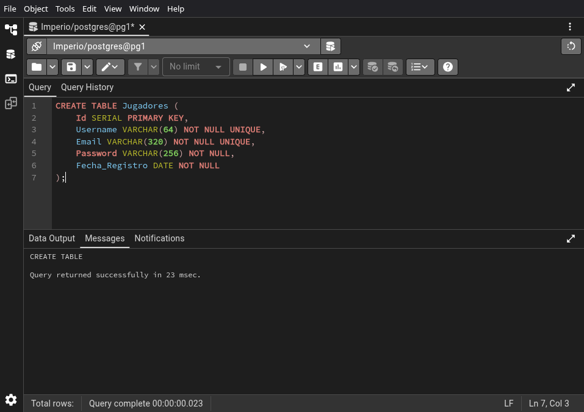
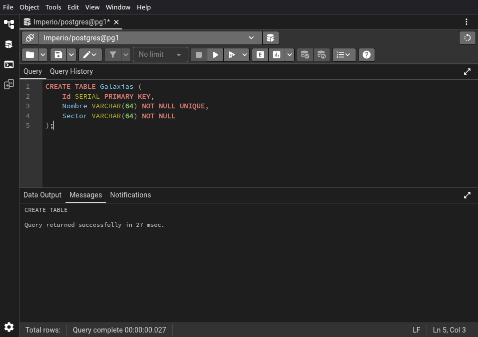
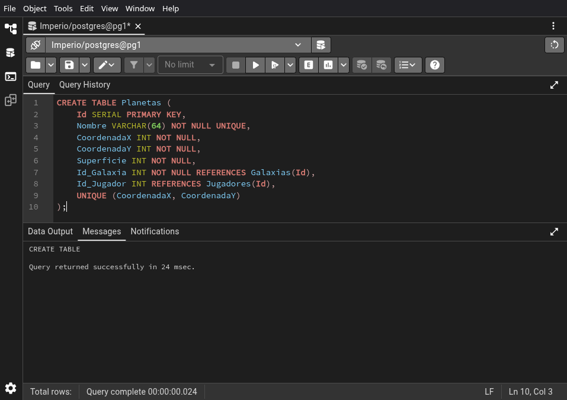
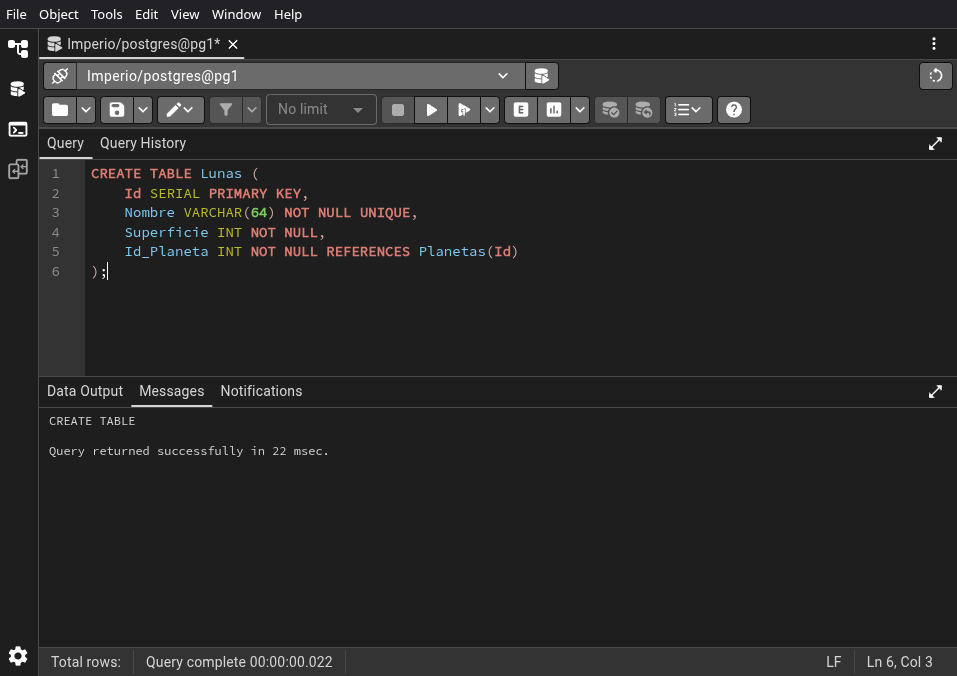
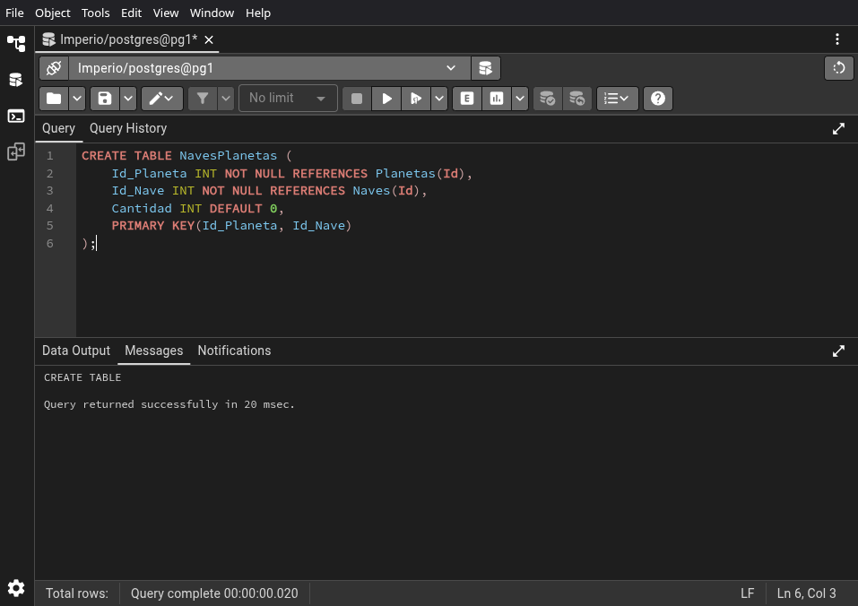
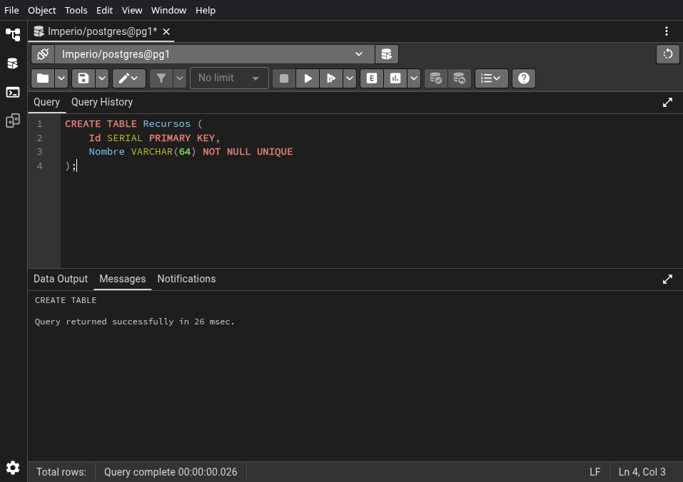
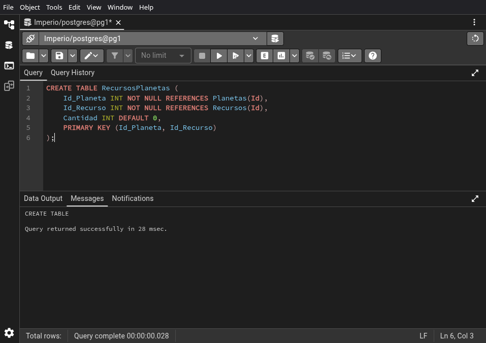
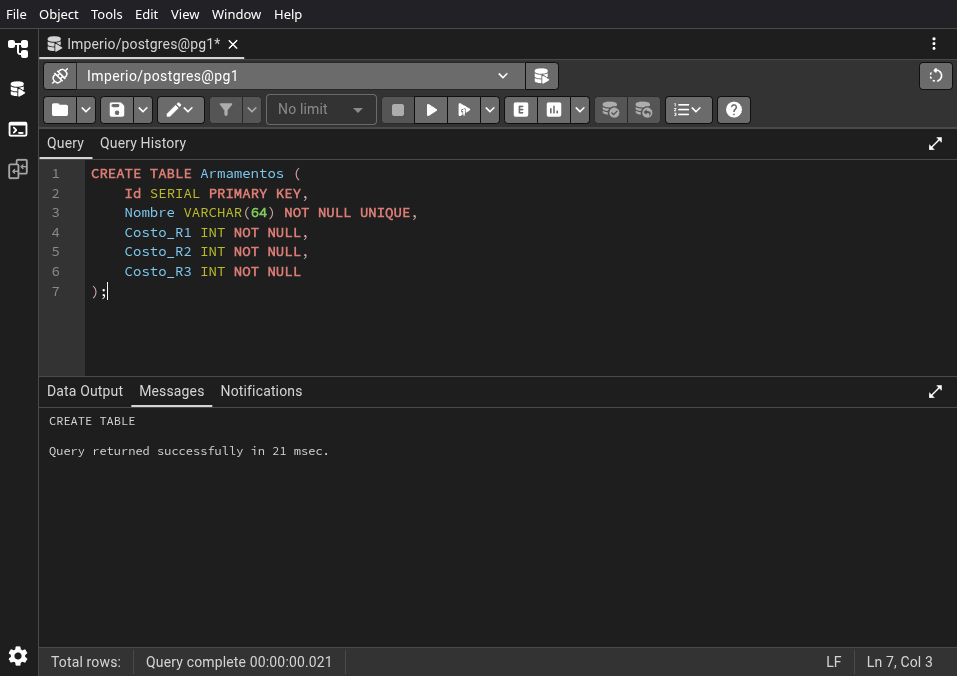
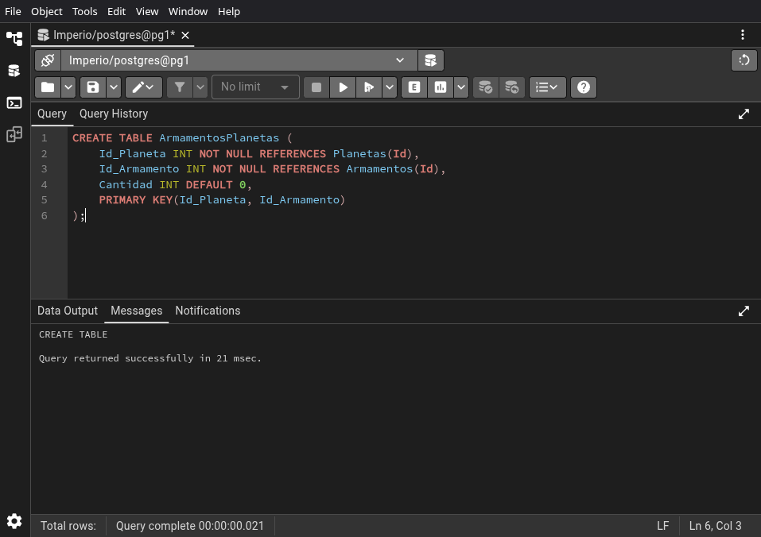
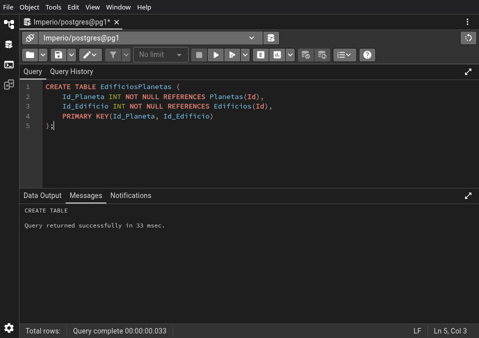

# 01-tablas


```sql
CREATE TABLE Jugadores (
	Id SERIAL PRIMARY KEY,
	Username VARCHAR(64) NOT NULL UNIQUE,
	Email VARCHAR(320) NOT NULL UNIQUE,
	Password VARCHAR(256) NOT NULL,
	Fecha_Registro DATE NOT NULL
);
```



\newpage


```sql
CREATE TABLE Galaxias (
	Id SERIAL PRIMARY KEY,
	Nombre VARCHAR(64) NOT NULL UNIQUE,
	Sector VARCHAR(64) NOT NULL
);
```



\newpage


```sql
CREATE TABLE Planetas (
	Id SERIAL PRIMARY KEY,
	Nombre VARCHAR(64) NOT NULL UNIQUE,
	CoordenadaX INT NOT NULL,
	CoordenadaY INT NOT NULL,
	Superficie INT NOT NULL,
	Id_Galaxia INT NOT NULL REFERENCES Galaxias(Id),
	Id_Jugador INT REFERENCES Jugadores(Id),
    UNIQUE (CoordenadaX, CoordenadaY)
);
```



\newpage


```sql
CREATE TABLE Lunas (
	Id SERIAL PRIMARY KEY,
	Nombre VARCHAR(64) NOT NULL UNIQUE,
	Superficie INT NOT NULL,
	Id_Planeta INT NOT NULL REFERENCES Planetas(Id)
);
```



\newpage


```sql
CREATE TABLE Naves (
	Id SERIAL PRIMARY KEY,
	Nombre VARCHAR(64) NOT NULL UNIQUE,
	Costo_R1 INT NOT NULL,
	Costo_R2 INT NOT NULL,
	Costo_R3 INT NOT NULL
);
```


\newpage


```sql
CREATE TABLE NavesPlanetas (
	Id_Planeta INT NOT NULL REFERENCES Planetas(Id),
	Id_Nave INT NOT NULL REFERENCES Naves(Id),
	Cantidad INT DEFAULT 0,
	PRIMARY KEY(Id_Planeta, Id_Nave)
);
```



\newpage


```sql
CREATE TABLE Recursos (
	Id SERIAL PRIMARY KEY,
	Nombre VARCHAR(64) NOT NULL UNIQUE
);
```



\newpage


```sql
CREATE TABLE RecursosPlanetas (
    Id_Planeta INT NOT NULL REFERENCES Planetas(Id),
    Id_Recurso INT NOT NULL REFERENCES Recursos(Id),
    Cantidad INT DEFAULT 0,
    PRIMARY KEY (Id_Planeta, Id_Recurso)
);
```



\newpage


```sql
CREATE TABLE Armamentos (
	Id SERIAL PRIMARY KEY,
	Nombre VARCHAR(64) NOT NULL UNIQUE,
	Costo_R1 INT NOT NULL,
	Costo_R2 INT NOT NULL,
	Costo_R3 INT NOT NULL
);
```



\newpage


```sql
CREATE TABLE ArmamentosPlanetas (
    Id_Planeta INT NOT NULL REFERENCES Planetas(Id),
    Id_Armamento INT NOT NULL REFERENCES Armamentos(Id),
    Cantidad INT DEFAULT 0,
    PRIMARY KEY(Id_Planeta, Id_Armamento)
);
```



\newpage


```sql
CREATE TABLE Edificios (
	Id SERIAL PRIMARY KEY,
	Nombre VARCHAR(64) NOT NULL UNIQUE,
	Costo_R1 INT NOT NULL,
	Costo_R2 INT NOT NULL,
	Costo_R3 INT NOT NULL
);
```


\newpage


```sql
CREATE TABLE EdificiosPlanetas (
    Id_Planeta INT NOT NULL REFERENCES Planetas(Id),
    Id_Edificio INT NOT NULL REFERENCES Edificios(Id),
    PRIMARY KEY(Id_Planeta, Id_Edificio)
);
```



\newpage


