# 02-datos


```sql
INSERT INTO Jugadores (Username, Email, Password, Fecha_Registro)
VALUES ('astro_gamer', 'astro_gamer@email.com', 'estelar123', '2024-02-18');
```

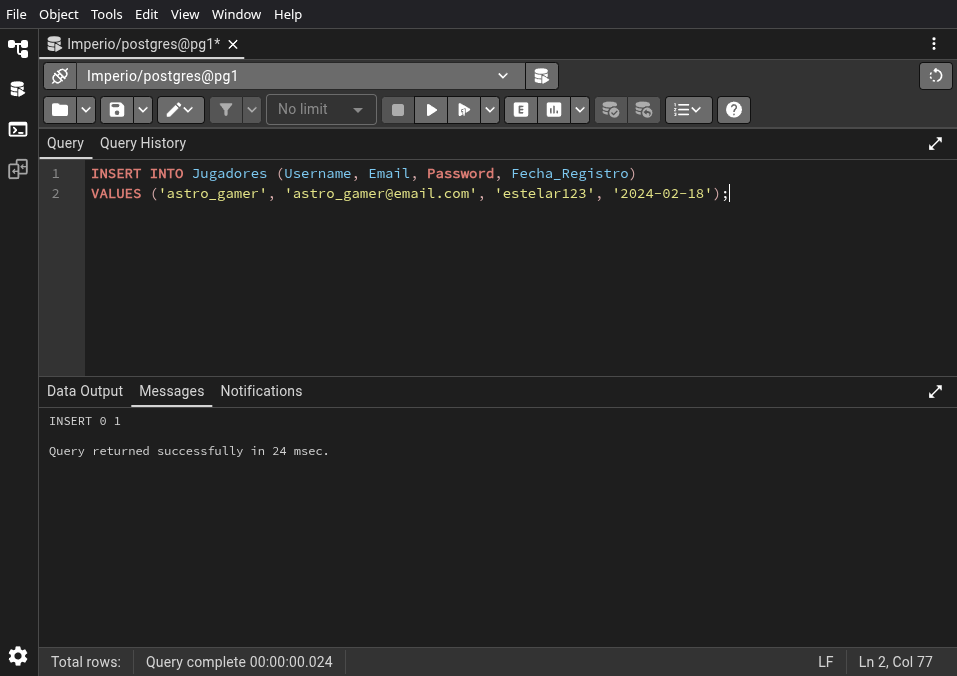

\newpage


```sql
INSERT INTO Jugadores (Username, Email, Password, Fecha_Registro)
VALUES ('galactic_ruler', 'ruler@galaxy.com', 'ruler567', '2024-02-18');
```


\newpage


```sql
INSERT INTO Jugadores (Username, Email, Password, Fecha_Registro)
VALUES ('cosmic_explorer', 'explorer@universe.com', 'explore321', '2024-02-18');
```

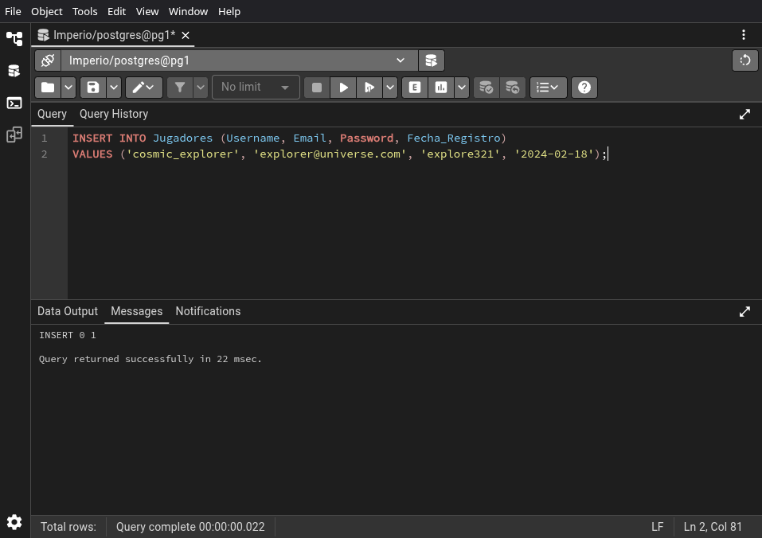

\newpage


```sql
INSERT INTO Jugadores (Username, Email, Password, Fecha_Registro)
VALUES ('space_commander', 'commander@space.com', 'command789', '2024-02-18');
```


\newpage


```sql
INSERT INTO Jugadores (Username, Email, Password, Fecha_Registro)
VALUES ('stargazer', 'stargazer@gmail.com', 'star1234', '2024-02-18');
```


\newpage


```sql
INSERT INTO Jugadores (Username, Email, Password, Fecha_Registro)
VALUES ('space_pioneer', 'pioneer@email.com', 'pioneer123', '2024-02-18');
```


\newpage


```sql
INSERT INTO Galaxias (Nombre, Sector)
VALUES ('Milky Way', 'Alpha');
```


\newpage


```sql
INSERT INTO Galaxias (Nombre, Sector)
VALUES ('Andromeda', 'Beta');
```


\newpage


```sql
INSERT INTO Galaxias (Nombre, Sector)
VALUES ('Pegasus', 'Gamma');
```


\newpage


```sql
INSERT INTO Galaxias (Nombre, Sector)
VALUES ('Orion', 'Delta');
```

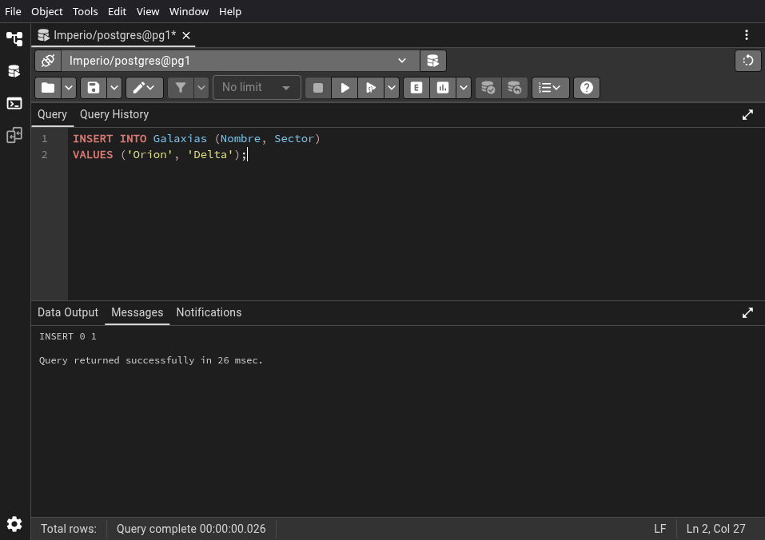

\newpage


```sql
INSERT INTO Galaxias (Nombre, Sector)
VALUES ('Centaurus', 'Epsilon');
```


\newpage


```sql
INSERT INTO Planetas (Nombre, CoordenadaX, CoordenadaY, Superficie, Id_Galaxia)
VALUES ('Nova Prime', 10, 20, 108728, 1);
```


\newpage


```sql
INSERT INTO Planetas (Nombre, CoordenadaX, CoordenadaY, Superficie, Id_Galaxia)
VALUES ('Stellar Haven', 15, 25, 4884, 2);
```


\newpage


```sql
INSERT INTO Planetas (Nombre, CoordenadaX, CoordenadaY, Superficie, Id_Galaxia)
VALUES ('Astral Oasis', 8, 30, 142984, 1);
```


\newpage


```sql
INSERT INTO Planetas (Nombre, CoordenadaX, CoordenadaY, Superficie, Id_Galaxia)
VALUES ('Celestial Outpost', 12, 18, 9452, 3);
```


\newpage


```sql
INSERT INTO Planetas (Nombre, CoordenadaX, CoordenadaY, Superficie, Id_Galaxia)
VALUES ('Galactic Citadel', 25, 15, 51118, 4);
```


\newpage


```sql
INSERT INTO Planetas (Nombre, CoordenadaX, CoordenadaY, Superficie, Id_Galaxia)
VALUES ('Starlight Sanctuary', 5, 12, 7534, 1);
```

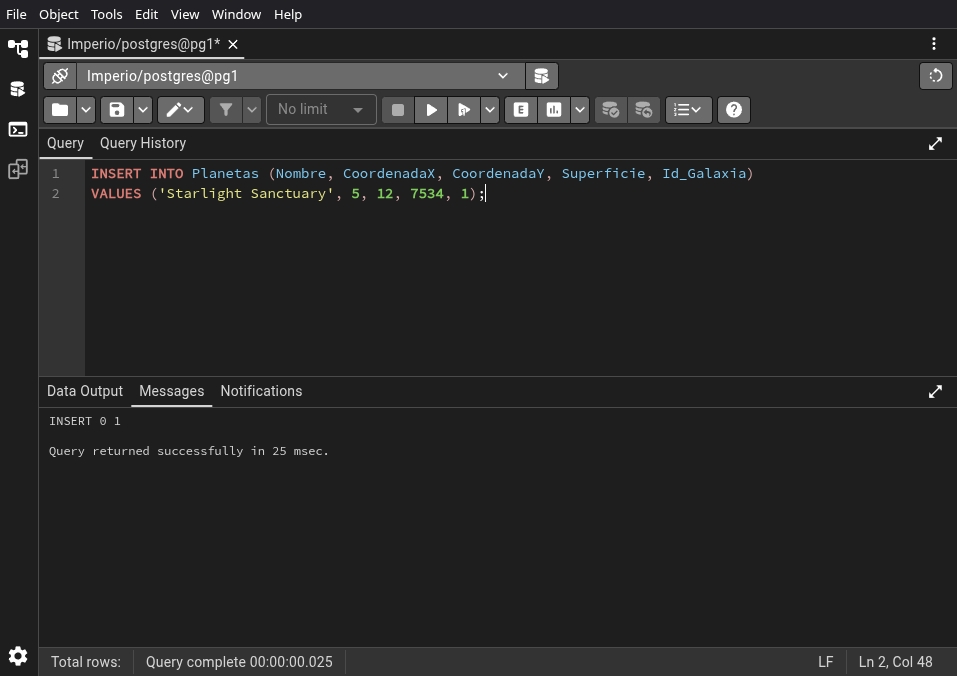

\newpage


```sql
INSERT INTO Planetas (Nombre, CoordenadaX, CoordenadaY, Superficie, Id_Galaxia)
VALUES ('Celestial Outpost II', 18, 22, 49532, 2);
```


\newpage


```sql
INSERT INTO Planetas (Nombre, CoordenadaX, CoordenadaY, Superficie, Id_Galaxia)
VALUES ('Nebula Nexus', 30, 8, 6794, 3);
```


\newpage


```sql
INSERT INTO Planetas (Nombre, CoordenadaX, CoordenadaY, Superficie, Id_Galaxia)
VALUES ('Solar Haven', 10, 30, 12756, 1);
```

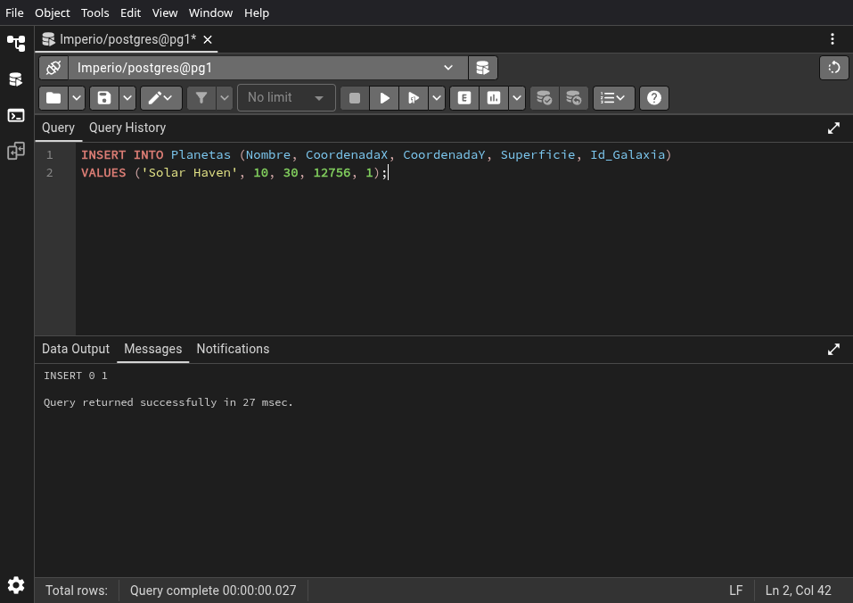

\newpage


```sql
INSERT INTO Planetas (Nombre, CoordenadaX, CoordenadaY, Superficie, Id_Galaxia)
VALUES ('Asteroid Haven', 22, 17, 12104, 4);
```


\newpage


```sql
INSERT INTO Lunas (Nombre, Superficie, Id_Planeta)
VALUES ('Luminara', 1524, 1);
```


\newpage


```sql
INSERT INTO Lunas (Nombre, Superficie, Id_Planeta)
VALUES ('Nightshade', 1289, 2);
```


\newpage


```sql
INSERT INTO Lunas (Nombre, Superficie, Id_Planeta)
VALUES ('Galaxysong', 1811, 3);
```


\newpage


```sql
INSERT INTO Lunas (Nombre, Superficie, Id_Planeta)
VALUES ('StellarDust', 2037, 4);
```


\newpage


```sql
INSERT INTO Lunas (Nombre, Superficie, Id_Planeta)
VALUES ('MoonlightGrove', 1699, 5);
```


\newpage


```sql
INSERT INTO Lunas (Nombre, Superficie, Id_Planeta)
VALUES ('GlimmeringOrbit', 1387, 1);
```

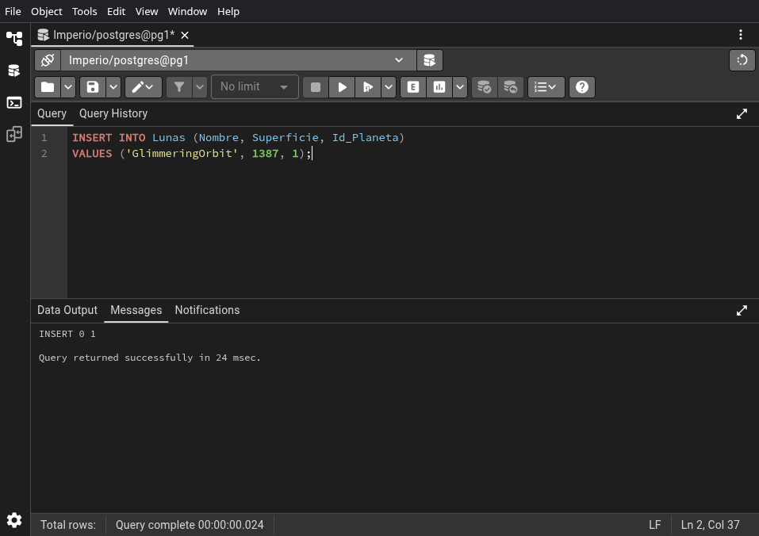

\newpage


```sql
INSERT INTO Lunas (Nombre, Superficie, Id_Planeta)
VALUES ('EclipseHarbor', 1114, 2);
```


\newpage


```sql
INSERT INTO Lunas (Nombre, Superficie, Id_Planeta)
VALUES ('MoonstoneMeadow', 1532, 3);
```

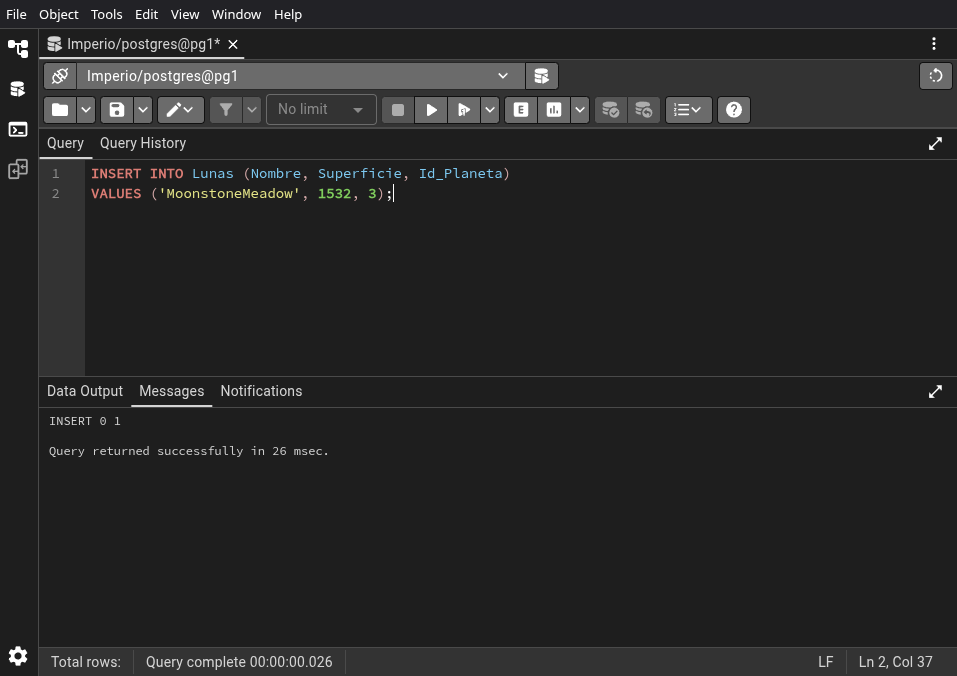

\newpage


```sql
INSERT INTO Lunas (Nombre, Superficie, Id_Planeta)
VALUES ('StellarRefuge', 1844, 4);
```


\newpage


```sql
INSERT INTO Lunas (Nombre, Superficie, Id_Planeta)
VALUES ('CosmicSerenity', 1656, 5);
```

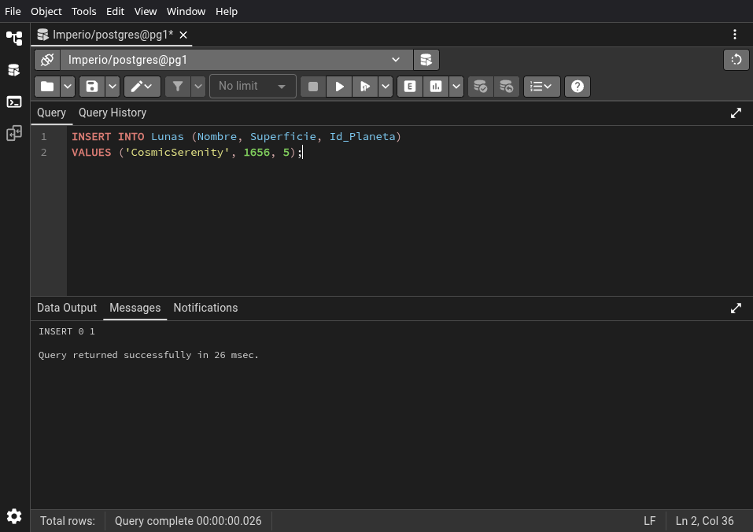

\newpage


```sql
INSERT INTO Lunas (Nombre, Superficie, Id_Planeta)
VALUES ('Luminara II', 1457, 6);
```


\newpage


```sql
INSERT INTO Lunas (Nombre, Superficie, Id_Planeta)
VALUES ('Nightshade II', 1228, 7);
```


\newpage


```sql
INSERT INTO Lunas (Nombre, Superficie, Id_Planeta)
VALUES ('Galaxysong II', 1791, 8);
```

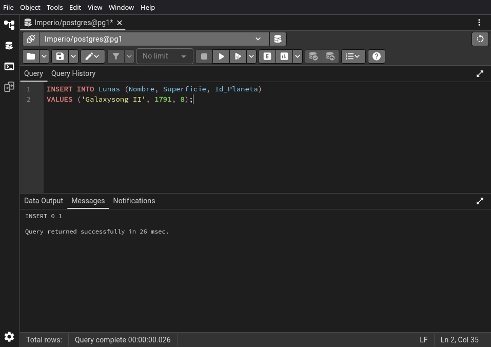

\newpage


```sql
INSERT INTO Lunas (Nombre, Superficie, Id_Planeta)
VALUES ('StellarDust II', 2033, 9);
```


\newpage


```sql
INSERT INTO Lunas (Nombre, Superficie, Id_Planeta)
VALUES ('MoonlightGrove II', 1578, 10);
```


\newpage


```sql
INSERT INTO Naves (Nombre, Costo_R1, Costo_R2, Costo_R3)
VALUES ('Caza Estelar', 100, 50, 30);
```


\newpage


```sql
INSERT INTO Naves (Nombre, Costo_R1, Costo_R2, Costo_R3)
VALUES ('Destructor Interplanetario', 200, 100, 150);
```


\newpage


```sql
INSERT INTO Naves (Nombre, Costo_R1, Costo_R2, Costo_R3)
VALUES ('Nave de Colonización', 150, 80, 100);
```

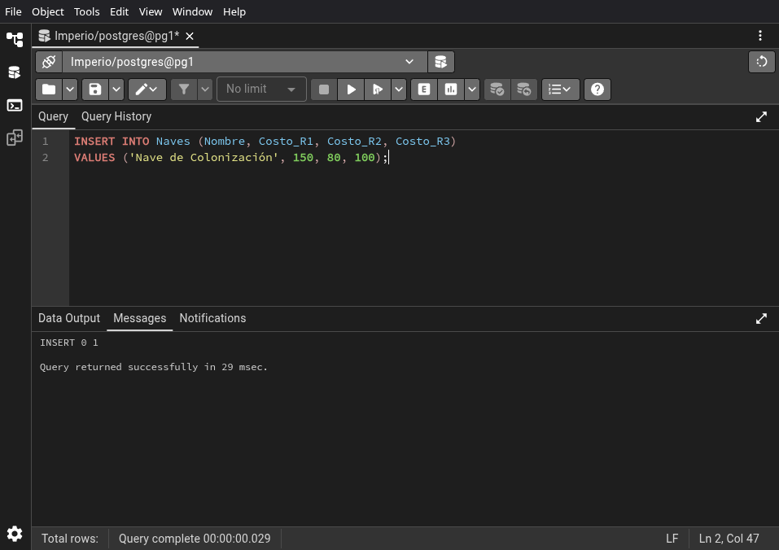

\newpage


```sql
INSERT INTO Naves (Nombre, Costo_R1, Costo_R2, Costo_R3)
VALUES ('Transportador de Recursos', 80, 120, 50);
```

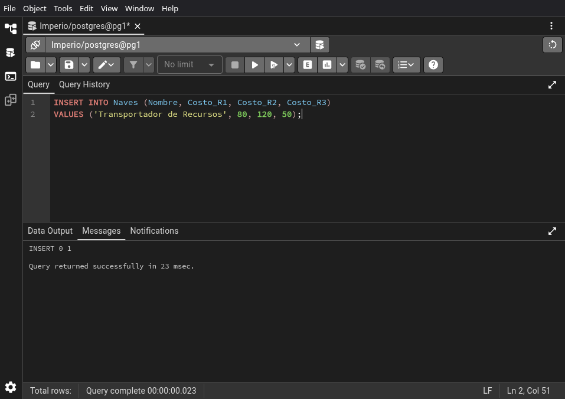

\newpage


```sql
INSERT INTO Naves (Nombre, Costo_R1, Costo_R2, Costo_R3)
VALUES ('Nave de Exploración', 120, 70, 90);
```


\newpage


```sql
INSERT INTO Recursos (Nombre) VALUES ('Metal');
```

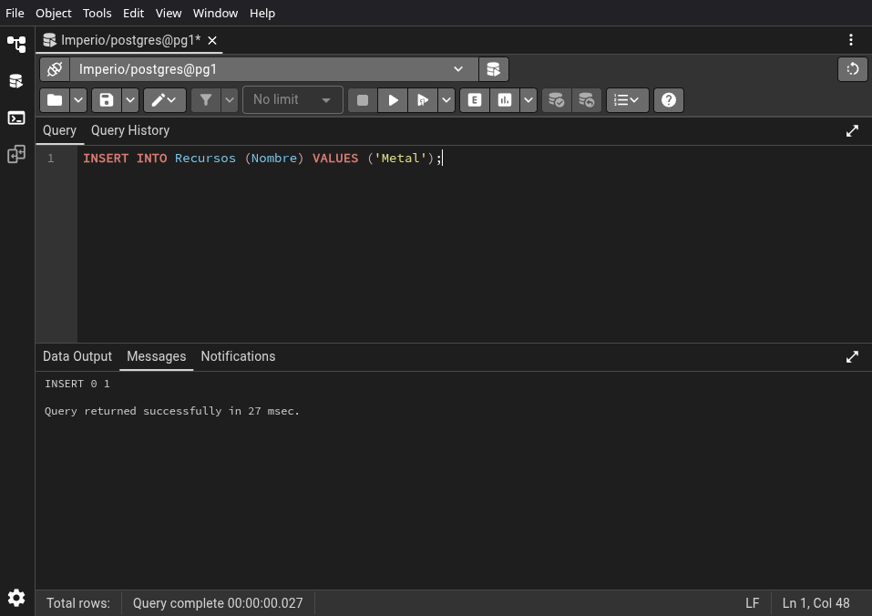

\newpage


```sql
INSERT INTO Recursos (Nombre) VALUES ('Deuterio');
```

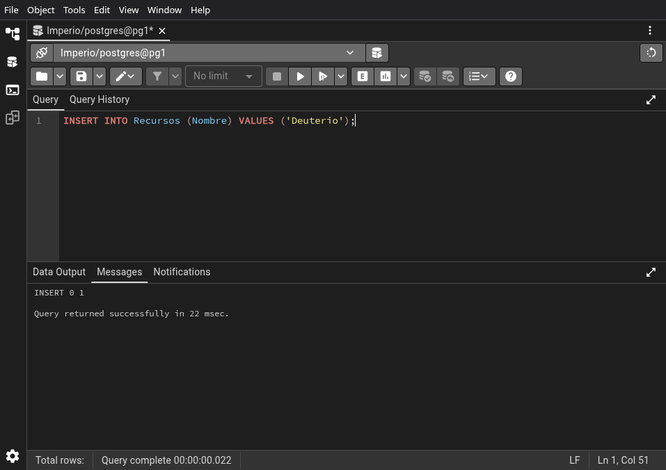

\newpage


```sql
INSERT INTO Recursos (Nombre) VALUES ('Energía');
```

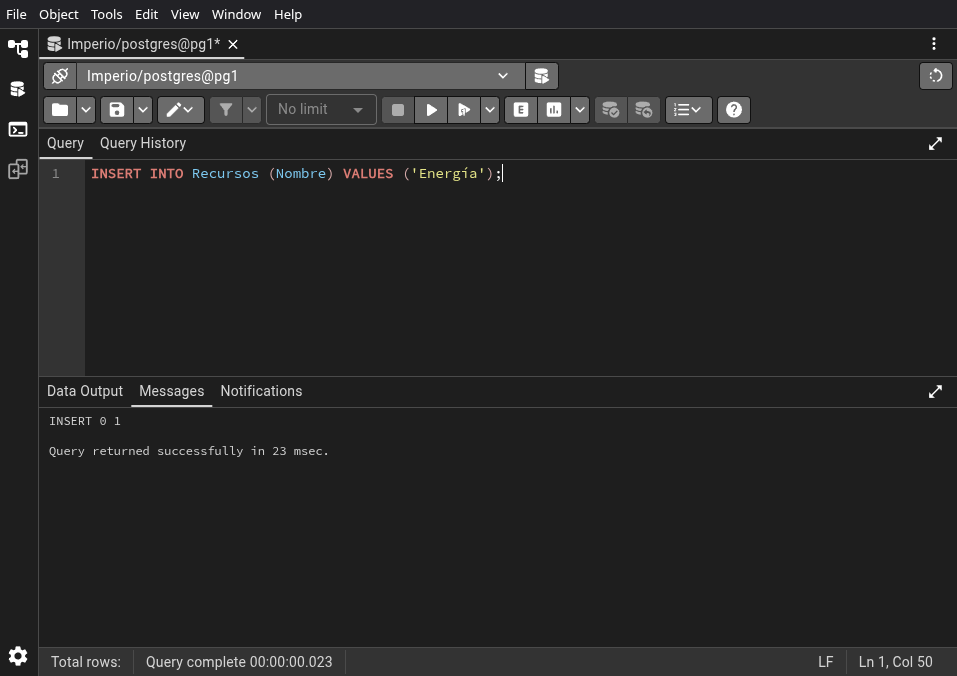

\newpage


```sql
INSERT INTO Armamentos (Nombre, Costo_R1, Costo_R2, Costo_R3)
VALUES ('Cañón de Plasma', 150, 100, 80);
```


\newpage


```sql
INSERT INTO Armamentos (Nombre, Costo_R1, Costo_R2, Costo_R3)
VALUES ('Torreta de Defensa', 100, 80, 120);
```


\newpage


```sql
INSERT INTO Armamentos (Nombre, Costo_R1, Costo_R2, Costo_R3)
VALUES ('Láser de Precisión', 120, 150, 100);
```


\newpage


```sql
INSERT INTO Armamentos (Nombre, Costo_R1, Costo_R2, Costo_R3)
VALUES ('Bomba de Neutrinos', 80, 120, 150);
```

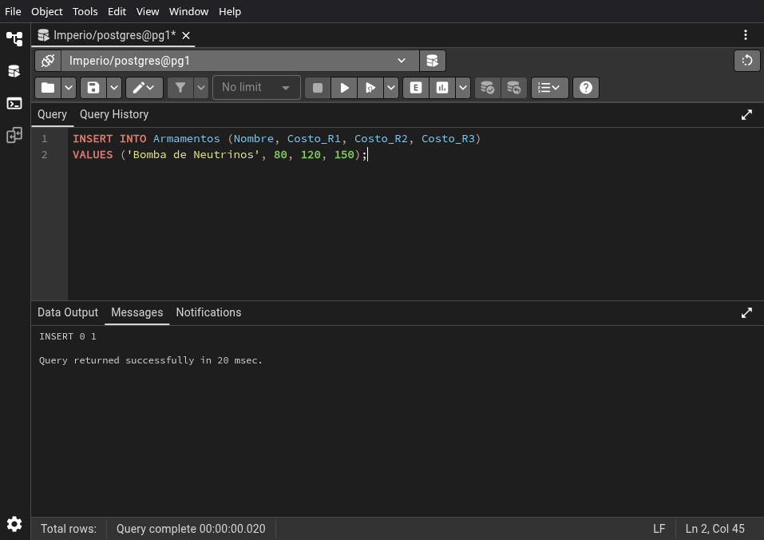

\newpage


```sql
INSERT INTO Armamentos (Nombre, Costo_R1, Costo_R2, Costo_R3)
VALUES ('Escudo de Energía', 100, 150, 80);
```


\newpage


```sql
INSERT INTO Edificios (Nombre, Costo_R1, Costo_R2, Costo_R3)
VALUES ('Centro de Investigación', 500, 200, 300);
```


\newpage


```sql
INSERT INTO Edificios (Nombre, Costo_R1, Costo_R2, Costo_R3)
VALUES ('Hangar de Naves', 300, 400, 200);
```


\newpage


```sql
INSERT INTO Edificios (Nombre, Costo_R1, Costo_R2, Costo_R3)
VALUES ('Planta de Energía Solar', 200, 300, 500);
```


\newpage


```sql
INSERT INTO Edificios (Nombre, Costo_R1, Costo_R2, Costo_R3)
VALUES ('Defensa Planetaria', 400, 200, 300);
```


\newpage


```sql
INSERT INTO Edificios (Nombre, Costo_R1, Costo_R2, Costo_R3)
VALUES ('Puerto Espacial', 300, 500, 200);
```


\newpage


```sql
INSERT INTO Edificios (Nombre, Costo_R1, Costo_R2, Costo_R3)
VALUES ('Sintetizador de Deuterio', 250, 400, 150);
```


\newpage


```sql
INSERT INTO Edificios (Nombre, Costo_R1, Costo_R2, Costo_R3)
VALUES ('Almacén de Metales', 150, 250, 100);
```


\newpage


