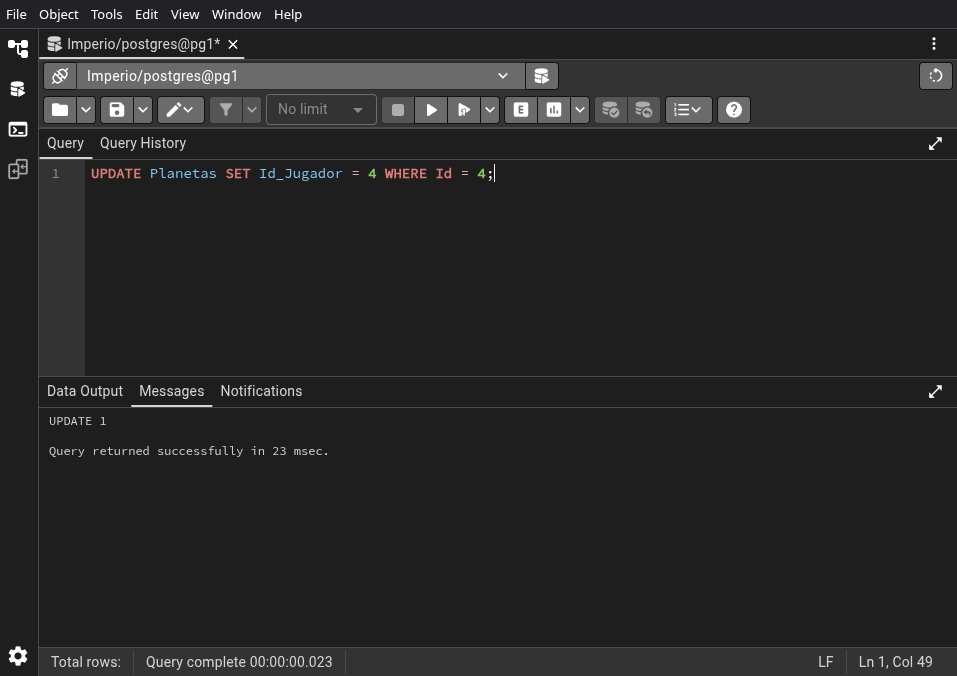
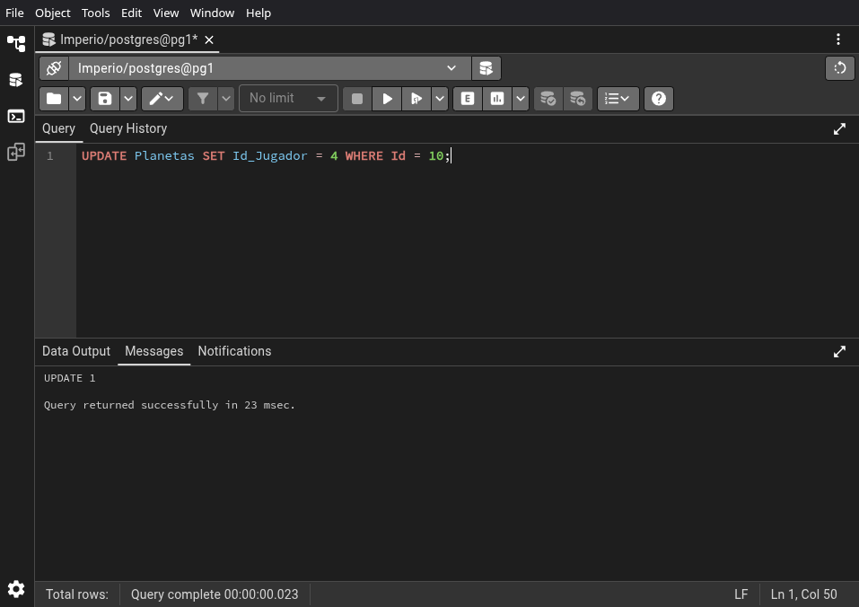
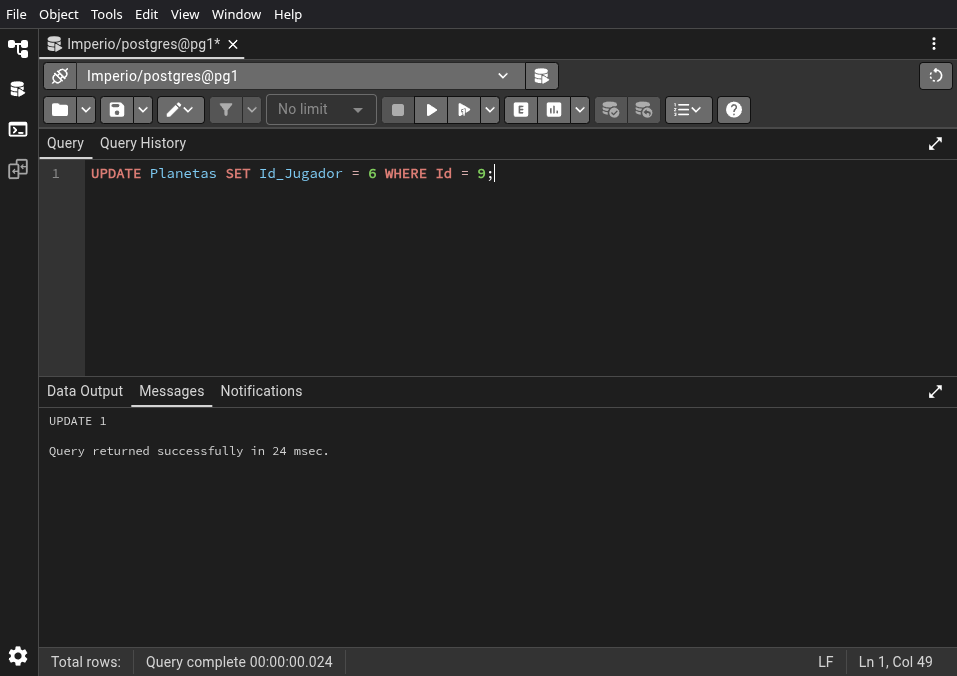

# 03.01-queries


```sql
UPDATE Planetas SET Id_Jugador = 1 WHERE Id = 1;
```


\newpage


```sql
UPDATE Planetas SET Id_Jugador = 1 WHERE Id = 3;
```


\newpage


```sql
UPDATE Planetas SET Id_Jugador = 1 WHERE Id = 6;
```


\newpage


```sql
UPDATE Planetas SET Id_Jugador = 2 WHERE Id = 2;
```


\newpage


```sql
UPDATE Planetas SET Id_Jugador = 2 WHERE Id = 7;
```


\newpage


```sql
UPDATE Planetas SET Id_Jugador = 3 WHERE Id = 8;
```


\newpage


```sql
UPDATE Planetas SET Id_Jugador = 4 WHERE Id = 4;
```



\newpage


```sql
UPDATE Planetas SET Id_Jugador = 4 WHERE Id = 10;
```



\newpage


```sql
UPDATE Planetas SET Id_Jugador = 5 WHERE Id = 5;
```


\newpage


```sql
UPDATE Planetas SET Id_Jugador = 6 WHERE Id = 9;
```



\newpage


