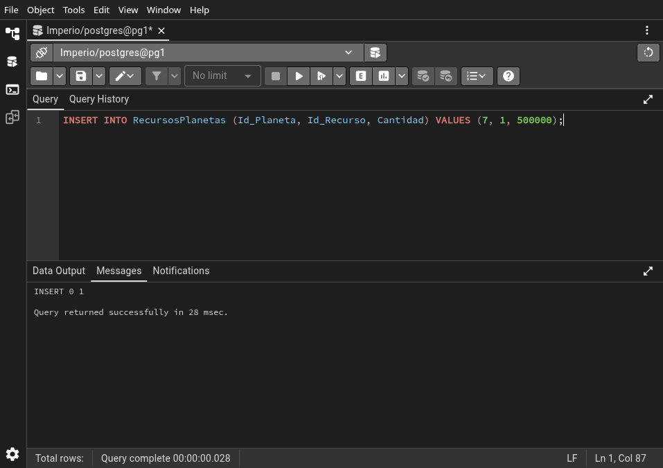

# 03.02-queries


```sql
INSERT INTO RecursosPlanetas (Id_Planeta, Id_Recurso, Cantidad) VALUES (1, 1, 500000);
```


\newpage


```sql
INSERT INTO RecursosPlanetas (Id_Planeta, Id_Recurso, Cantidad) VALUES (1, 2, 23000);
```


\newpage


```sql
INSERT INTO RecursosPlanetas (Id_Planeta, Id_Recurso, Cantidad) VALUES (1, 3, 25000);
```


\newpage


```sql
INSERT INTO RecursosPlanetas (Id_Planeta, Id_Recurso, Cantidad) VALUES (2, 1, 500000);
```


\newpage


```sql
INSERT INTO RecursosPlanetas (Id_Planeta, Id_Recurso, Cantidad) VALUES (2, 2, 23000);
```


\newpage


```sql
INSERT INTO RecursosPlanetas (Id_Planeta, Id_Recurso, Cantidad) VALUES (2, 3, 25000);
```


\newpage


```sql
INSERT INTO RecursosPlanetas (Id_Planeta, Id_Recurso, Cantidad) VALUES (3, 1, 500000);
```


\newpage


```sql
INSERT INTO RecursosPlanetas (Id_Planeta, Id_Recurso, Cantidad) VALUES (3, 2, 23000);
```


\newpage


```sql
INSERT INTO RecursosPlanetas (Id_Planeta, Id_Recurso, Cantidad) VALUES (3, 3, 25000);
```


\newpage


```sql
INSERT INTO RecursosPlanetas (Id_Planeta, Id_Recurso, Cantidad) VALUES (4, 1, 500000);
```


\newpage


```sql
INSERT INTO RecursosPlanetas (Id_Planeta, Id_Recurso, Cantidad) VALUES (4, 2, 23000);
```


\newpage


```sql
INSERT INTO RecursosPlanetas (Id_Planeta, Id_Recurso, Cantidad) VALUES (4, 3, 25000);
```


\newpage


```sql
INSERT INTO RecursosPlanetas (Id_Planeta, Id_Recurso, Cantidad) VALUES (5, 1, 500000);
```


\newpage


```sql
INSERT INTO RecursosPlanetas (Id_Planeta, Id_Recurso, Cantidad) VALUES (5, 2, 23000);
```


\newpage


```sql
INSERT INTO RecursosPlanetas (Id_Planeta, Id_Recurso, Cantidad) VALUES (5, 3, 25000);
```


\newpage


```sql
INSERT INTO RecursosPlanetas (Id_Planeta, Id_Recurso, Cantidad) VALUES (6, 1, 500000);
```


\newpage


```sql
INSERT INTO RecursosPlanetas (Id_Planeta, Id_Recurso, Cantidad) VALUES (6, 2, 23000);
```


\newpage


```sql
INSERT INTO RecursosPlanetas (Id_Planeta, Id_Recurso, Cantidad) VALUES (6, 3, 25000);
```


\newpage


```sql
INSERT INTO RecursosPlanetas (Id_Planeta, Id_Recurso, Cantidad) VALUES (7, 1, 500000);
```



\newpage


```sql
INSERT INTO RecursosPlanetas (Id_Planeta, Id_Recurso, Cantidad) VALUES (7, 2, 23000);
```


\newpage


```sql
INSERT INTO RecursosPlanetas (Id_Planeta, Id_Recurso, Cantidad) VALUES (7, 3, 25000);
```


\newpage


```sql
INSERT INTO RecursosPlanetas (Id_Planeta, Id_Recurso, Cantidad) VALUES (8, 1, 500000);
```


\newpage


```sql
INSERT INTO RecursosPlanetas (Id_Planeta, Id_Recurso, Cantidad) VALUES (8, 2, 23000);
```


\newpage


```sql
INSERT INTO RecursosPlanetas (Id_Planeta, Id_Recurso, Cantidad) VALUES (8, 3, 25000);
```


\newpage


```sql
INSERT INTO RecursosPlanetas (Id_Planeta, Id_Recurso, Cantidad) VALUES (9, 1, 500000);
```


\newpage


```sql
INSERT INTO RecursosPlanetas (Id_Planeta, Id_Recurso, Cantidad) VALUES (9, 2, 23000);
```


\newpage


```sql
INSERT INTO RecursosPlanetas (Id_Planeta, Id_Recurso, Cantidad) VALUES (9, 3, 25000);
```


\newpage


```sql
INSERT INTO RecursosPlanetas (Id_Planeta, Id_Recurso, Cantidad) VALUES (10, 1, 500000);
```


\newpage


```sql
INSERT INTO RecursosPlanetas (Id_Planeta, Id_Recurso, Cantidad) VALUES (10, 2, 23000);
```


\newpage


```sql
INSERT INTO RecursosPlanetas (Id_Planeta, Id_Recurso, Cantidad) VALUES (10, 3, 25000);
```


\newpage


