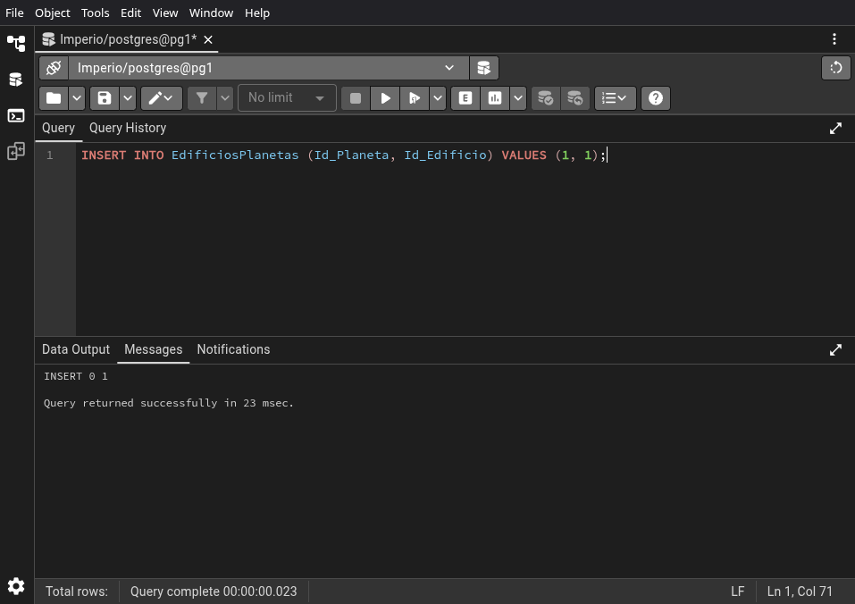
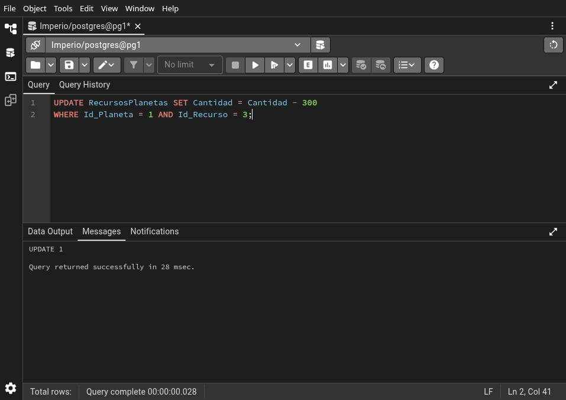
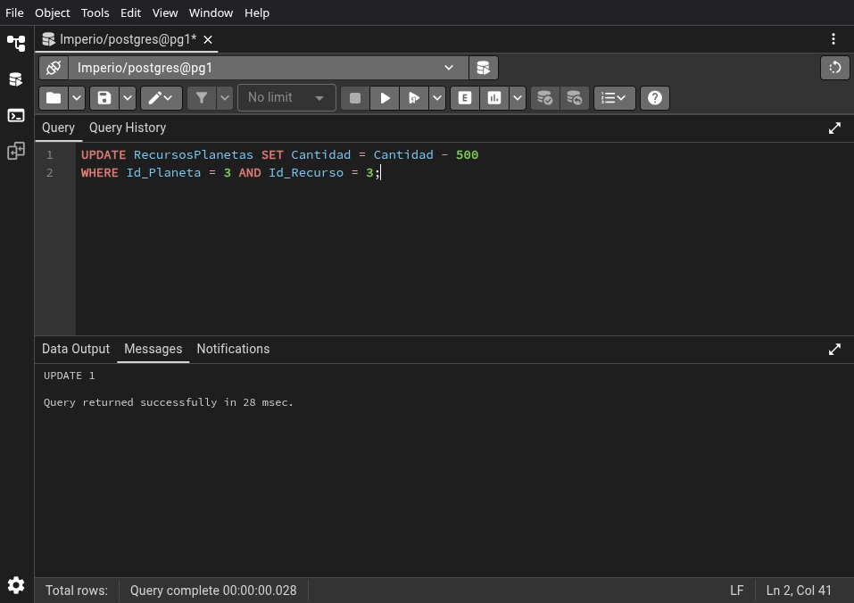
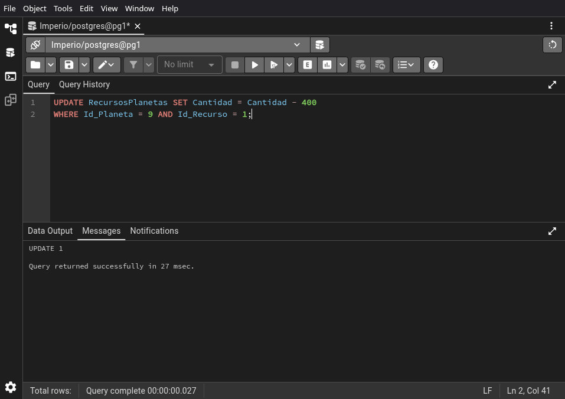
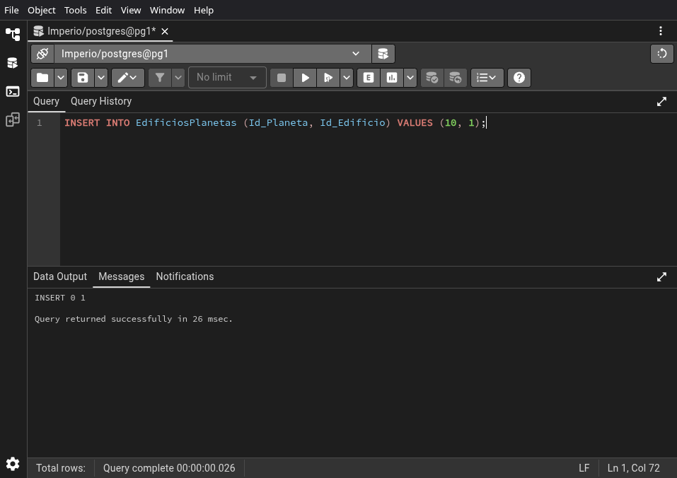
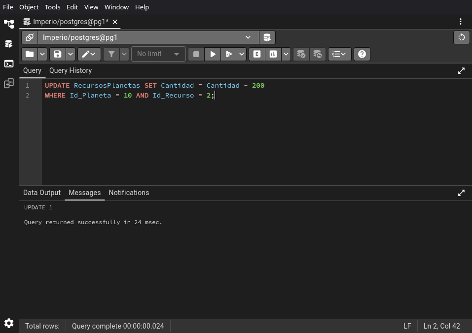
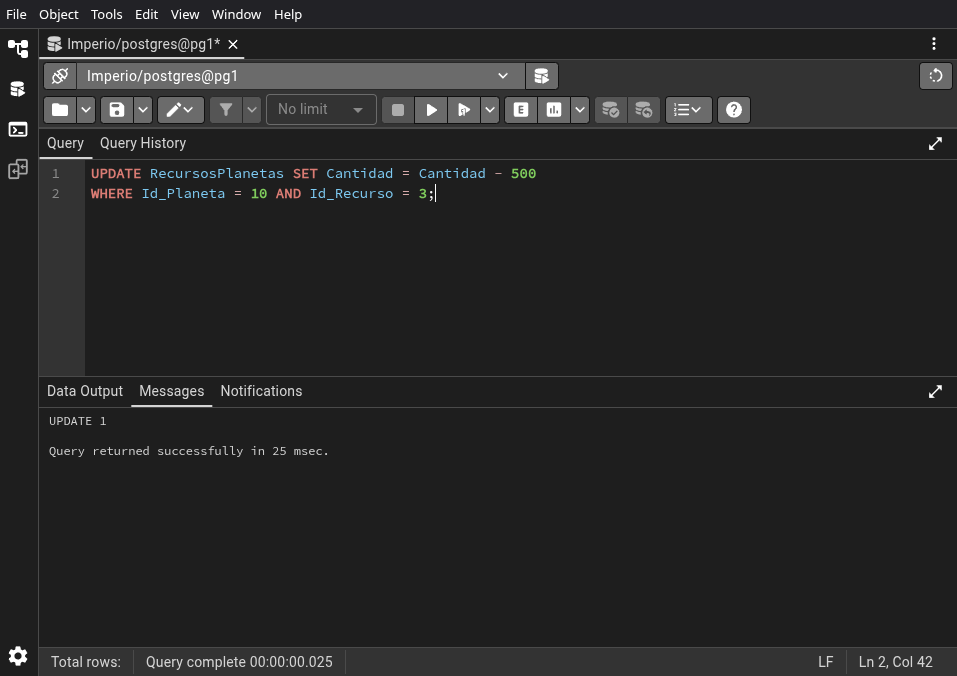

# 03.03-queries


```sql
INSERT INTO EdificiosPlanetas (Id_Planeta, Id_Edificio) VALUES (1, 1);
```



\newpage


```sql
UPDATE RecursosPlanetas SET Cantidad = Cantidad - 500
WHERE Id_Planeta = 1 AND Id_Recurso = 1;
```


\newpage


```sql
UPDATE RecursosPlanetas SET Cantidad = Cantidad - 200
WHERE Id_Planeta = 1 AND Id_Recurso = 2;
```


\newpage


```sql
UPDATE RecursosPlanetas SET Cantidad = Cantidad - 300
WHERE Id_Planeta = 1 AND Id_Recurso = 3;
```



\newpage


```sql
INSERT INTO EdificiosPlanetas (Id_Planeta, Id_Edificio) VALUES (1, 6);
```


\newpage


```sql
UPDATE RecursosPlanetas SET Cantidad = Cantidad - 300
WHERE Id_Planeta = 1 AND Id_Recurso = 1;
```


\newpage


```sql
UPDATE RecursosPlanetas SET Cantidad = Cantidad - 500
WHERE Id_Planeta = 1 AND Id_Recurso = 2;
```


\newpage


```sql
UPDATE RecursosPlanetas SET Cantidad = Cantidad - 200
WHERE Id_Planeta = 1 AND Id_Recurso = 3;
```


\newpage


```sql
INSERT INTO EdificiosPlanetas (Id_Planeta, Id_Edificio) VALUES (2, 2);
```


\newpage


```sql
UPDATE RecursosPlanetas SET Cantidad = Cantidad - 300
WHERE Id_Planeta = 2 AND Id_Recurso = 1;
```


\newpage


```sql
UPDATE RecursosPlanetas SET Cantidad = Cantidad - 400
WHERE Id_Planeta = 2 AND Id_Recurso = 2;
```


\newpage


```sql
UPDATE RecursosPlanetas SET Cantidad = Cantidad - 200
WHERE Id_Planeta = 2 AND Id_Recurso = 3;
```


\newpage


```sql
INSERT INTO EdificiosPlanetas (Id_Planeta, Id_Edificio) VALUES (2, 5);
```


\newpage


```sql
UPDATE RecursosPlanetas SET Cantidad = Cantidad - 400
WHERE Id_Planeta = 2 AND Id_Recurso = 1;
```


\newpage


```sql
UPDATE RecursosPlanetas SET Cantidad = Cantidad - 200
WHERE Id_Planeta = 2 AND Id_Recurso = 2;
```


\newpage


```sql
UPDATE RecursosPlanetas SET Cantidad = Cantidad - 300
WHERE Id_Planeta = 2 AND Id_Recurso = 3;
```


\newpage


```sql
INSERT INTO EdificiosPlanetas (Id_Planeta, Id_Edificio) VALUES (2, 7);
```


\newpage


```sql
UPDATE RecursosPlanetas SET Cantidad = Cantidad - 250
WHERE Id_Planeta = 2 AND Id_Recurso = 1;
```


\newpage


```sql
UPDATE RecursosPlanetas SET Cantidad = Cantidad - 400
WHERE Id_Planeta = 2 AND Id_Recurso = 2;
```


\newpage


```sql
UPDATE RecursosPlanetas SET Cantidad = Cantidad - 150
WHERE Id_Planeta = 2 AND Id_Recurso = 3;
```


\newpage


```sql
INSERT INTO EdificiosPlanetas (Id_Planeta, Id_Edificio) VALUES (3, 2);
```


\newpage


```sql
UPDATE RecursosPlanetas SET Cantidad = Cantidad - 300
WHERE Id_Planeta = 3 AND Id_Recurso = 1;
```


\newpage


```sql
UPDATE RecursosPlanetas SET Cantidad = Cantidad - 400
WHERE Id_Planeta = 3 AND Id_Recurso = 2;
```


\newpage


```sql
UPDATE RecursosPlanetas SET Cantidad = Cantidad - 200
WHERE Id_Planeta = 3 AND Id_Recurso = 3;
```


\newpage


```sql
INSERT INTO EdificiosPlanetas (Id_Planeta, Id_Edificio) VALUES (3, 3);
```


\newpage


```sql
UPDATE RecursosPlanetas SET Cantidad = Cantidad - 200
WHERE Id_Planeta = 3 AND Id_Recurso = 1;
```


\newpage


```sql
UPDATE RecursosPlanetas SET Cantidad = Cantidad - 300
WHERE Id_Planeta = 3 AND Id_Recurso = 2;
```


\newpage


```sql
UPDATE RecursosPlanetas SET Cantidad = Cantidad - 500
WHERE Id_Planeta = 3 AND Id_Recurso = 3;
```



\newpage


```sql
INSERT INTO EdificiosPlanetas (Id_Planeta, Id_Edificio) VALUES (4, 3);
```


\newpage


```sql
UPDATE RecursosPlanetas SET Cantidad = Cantidad - 200
WHERE Id_Planeta = 4 AND Id_Recurso = 1;
```


\newpage


```sql
UPDATE RecursosPlanetas SET Cantidad = Cantidad - 300
WHERE Id_Planeta = 4 AND Id_Recurso = 2;
```


\newpage


```sql
UPDATE RecursosPlanetas SET Cantidad = Cantidad - 500
WHERE Id_Planeta = 4 AND Id_Recurso = 3;
```


\newpage


```sql
INSERT INTO EdificiosPlanetas (Id_Planeta, Id_Edificio) VALUES (4, 4);
```


\newpage


```sql
UPDATE RecursosPlanetas SET Cantidad = Cantidad - 400
WHERE Id_Planeta = 4 AND Id_Recurso = 1;
```


\newpage


```sql
UPDATE RecursosPlanetas SET Cantidad = Cantidad - 200
WHERE Id_Planeta = 4 AND Id_Recurso = 2;
```


\newpage


```sql
UPDATE RecursosPlanetas SET Cantidad = Cantidad - 300
WHERE Id_Planeta = 4 AND Id_Recurso = 3;
```


\newpage


```sql
INSERT INTO EdificiosPlanetas (Id_Planeta, Id_Edificio) VALUES (5, 1);
```


\newpage


```sql
UPDATE RecursosPlanetas SET Cantidad = Cantidad - 500
WHERE Id_Planeta = 5 AND Id_Recurso = 1;
```


\newpage


```sql
UPDATE RecursosPlanetas SET Cantidad = Cantidad - 200
WHERE Id_Planeta = 5 AND Id_Recurso = 2;
```


\newpage


```sql
UPDATE RecursosPlanetas SET Cantidad = Cantidad - 300
WHERE Id_Planeta = 5 AND Id_Recurso = 3;
```


\newpage


```sql
INSERT INTO EdificiosPlanetas (Id_Planeta, Id_Edificio) VALUES (5, 2);
```


\newpage


```sql
UPDATE RecursosPlanetas SET Cantidad = Cantidad - 300
WHERE Id_Planeta = 5 AND Id_Recurso = 1;
```


\newpage


```sql
UPDATE RecursosPlanetas SET Cantidad = Cantidad - 400
WHERE Id_Planeta = 5 AND Id_Recurso = 2;
```


\newpage


```sql
UPDATE RecursosPlanetas SET Cantidad = Cantidad - 200
WHERE Id_Planeta = 5 AND Id_Recurso = 3;
```


\newpage


```sql
INSERT INTO EdificiosPlanetas (Id_Planeta, Id_Edificio) VALUES (6, 1);
```


\newpage


```sql
UPDATE RecursosPlanetas SET Cantidad = Cantidad - 500
WHERE Id_Planeta = 6 AND Id_Recurso = 1;
```


\newpage


```sql
UPDATE RecursosPlanetas SET Cantidad = Cantidad - 200
WHERE Id_Planeta = 6 AND Id_Recurso = 2;
```


\newpage


```sql
UPDATE RecursosPlanetas SET Cantidad = Cantidad - 300
WHERE Id_Planeta = 6 AND Id_Recurso = 3;
```


\newpage


```sql
INSERT INTO EdificiosPlanetas (Id_Planeta, Id_Edificio) VALUES (6, 6);
```


\newpage


```sql
UPDATE RecursosPlanetas SET Cantidad = Cantidad - 300
WHERE Id_Planeta = 6 AND Id_Recurso = 1;
```


\newpage


```sql
UPDATE RecursosPlanetas SET Cantidad = Cantidad - 500
WHERE Id_Planeta = 6 AND Id_Recurso = 2;
```


\newpage


```sql
UPDATE RecursosPlanetas SET Cantidad = Cantidad - 200
WHERE Id_Planeta = 6 AND Id_Recurso = 3;
```


\newpage


```sql
INSERT INTO EdificiosPlanetas (Id_Planeta, Id_Edificio) VALUES (7, 2);
```


\newpage


```sql
UPDATE RecursosPlanetas SET Cantidad = Cantidad - 300
WHERE Id_Planeta = 7 AND Id_Recurso = 1;
```


\newpage


```sql
UPDATE RecursosPlanetas SET Cantidad = Cantidad - 400
WHERE Id_Planeta = 7 AND Id_Recurso = 2;
```


\newpage


```sql
UPDATE RecursosPlanetas SET Cantidad = Cantidad - 200
WHERE Id_Planeta = 7 AND Id_Recurso = 3;
```


\newpage


```sql
INSERT INTO EdificiosPlanetas (Id_Planeta, Id_Edificio) VALUES (7, 3);
```


\newpage


```sql
UPDATE RecursosPlanetas SET Cantidad = Cantidad - 200
WHERE Id_Planeta = 7 AND Id_Recurso = 1;
```


\newpage


```sql
UPDATE RecursosPlanetas SET Cantidad = Cantidad - 300
WHERE Id_Planeta = 7 AND Id_Recurso = 2;
```


\newpage


```sql
UPDATE RecursosPlanetas SET Cantidad = Cantidad - 500
WHERE Id_Planeta = 7 AND Id_Recurso = 3;
```


\newpage


```sql
INSERT INTO EdificiosPlanetas (Id_Planeta, Id_Edificio) VALUES (8, 1);
```


\newpage


```sql
UPDATE RecursosPlanetas SET Cantidad = Cantidad - 500
WHERE Id_Planeta = 8 AND Id_Recurso = 1;
```


\newpage


```sql
UPDATE RecursosPlanetas SET Cantidad = Cantidad - 200
WHERE Id_Planeta = 8 AND Id_Recurso = 2;
```


\newpage


```sql
UPDATE RecursosPlanetas SET Cantidad = Cantidad - 300
WHERE Id_Planeta = 8 AND Id_Recurso = 3;
```


\newpage


```sql
INSERT INTO EdificiosPlanetas (Id_Planeta, Id_Edificio) VALUES (8, 7);
```


\newpage


```sql
UPDATE RecursosPlanetas SET Cantidad = Cantidad - 250
WHERE Id_Planeta = 8 AND Id_Recurso = 1;
```


\newpage


```sql
UPDATE RecursosPlanetas SET Cantidad = Cantidad - 400
WHERE Id_Planeta = 8 AND Id_Recurso = 2;
```


\newpage


```sql
UPDATE RecursosPlanetas SET Cantidad = Cantidad - 150
WHERE Id_Planeta = 8 AND Id_Recurso = 3;
```


\newpage


```sql
INSERT INTO EdificiosPlanetas (Id_Planeta, Id_Edificio) VALUES (9, 2);
```


\newpage


```sql
UPDATE RecursosPlanetas SET Cantidad = Cantidad - 300
WHERE Id_Planeta = 9 AND Id_Recurso = 1;
```


\newpage


```sql
UPDATE RecursosPlanetas SET Cantidad = Cantidad - 400
WHERE Id_Planeta = 9 AND Id_Recurso = 2;
```


\newpage


```sql
UPDATE RecursosPlanetas SET Cantidad = Cantidad - 200
WHERE Id_Planeta = 9 AND Id_Recurso = 3;
```


\newpage


```sql
INSERT INTO EdificiosPlanetas (Id_Planeta, Id_Edificio) VALUES (9, 5);
```


\newpage


```sql
UPDATE RecursosPlanetas SET Cantidad = Cantidad - 400
WHERE Id_Planeta = 9 AND Id_Recurso = 1;
```



\newpage


```sql
UPDATE RecursosPlanetas SET Cantidad = Cantidad - 200
WHERE Id_Planeta = 9 AND Id_Recurso = 2;
```


\newpage


```sql
UPDATE RecursosPlanetas SET Cantidad = Cantidad - 300
WHERE Id_Planeta = 9 AND Id_Recurso = 3;
```


\newpage


```sql
INSERT INTO EdificiosPlanetas (Id_Planeta, Id_Edificio) VALUES (9, 6);
```


\newpage


```sql
UPDATE RecursosPlanetas SET Cantidad = Cantidad - 300
WHERE Id_Planeta = 9 AND Id_Recurso = 1;
```


\newpage


```sql
UPDATE RecursosPlanetas SET Cantidad = Cantidad - 500
WHERE Id_Planeta = 9 AND Id_Recurso = 2;
```


\newpage


```sql
UPDATE RecursosPlanetas SET Cantidad = Cantidad - 200
WHERE Id_Planeta = 9 AND Id_Recurso = 3;
```


\newpage


```sql
INSERT INTO EdificiosPlanetas (Id_Planeta, Id_Edificio) VALUES (10, 1);
```



\newpage


```sql
UPDATE RecursosPlanetas SET Cantidad = Cantidad - 500
WHERE Id_Planeta = 10 AND Id_Recurso = 1;
```


\newpage


```sql
UPDATE RecursosPlanetas SET Cantidad = Cantidad - 200
WHERE Id_Planeta = 10 AND Id_Recurso = 2;
```



\newpage


```sql
UPDATE RecursosPlanetas SET Cantidad = Cantidad - 300
WHERE Id_Planeta = 10 AND Id_Recurso = 3;
```


\newpage


```sql
INSERT INTO EdificiosPlanetas (Id_Planeta, Id_Edificio) VALUES (10, 3);
```


\newpage


```sql
UPDATE RecursosPlanetas SET Cantidad = Cantidad - 200
WHERE Id_Planeta = 10 AND Id_Recurso = 1;
```


\newpage


```sql
UPDATE RecursosPlanetas SET Cantidad = Cantidad - 300
WHERE Id_Planeta = 10 AND Id_Recurso = 2;
```


\newpage


```sql
UPDATE RecursosPlanetas SET Cantidad = Cantidad - 500
WHERE Id_Planeta = 10 AND Id_Recurso = 3;
```



\newpage


