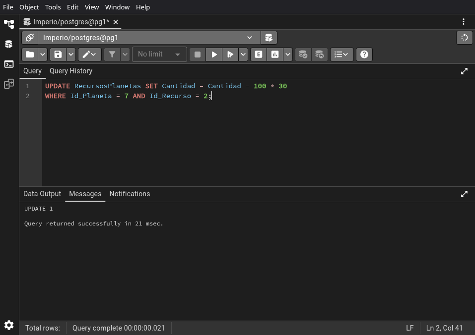
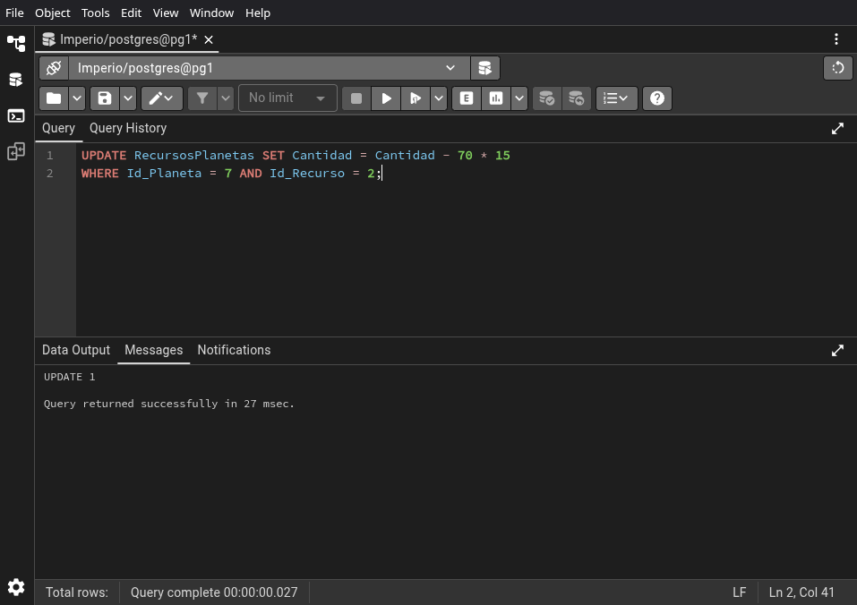
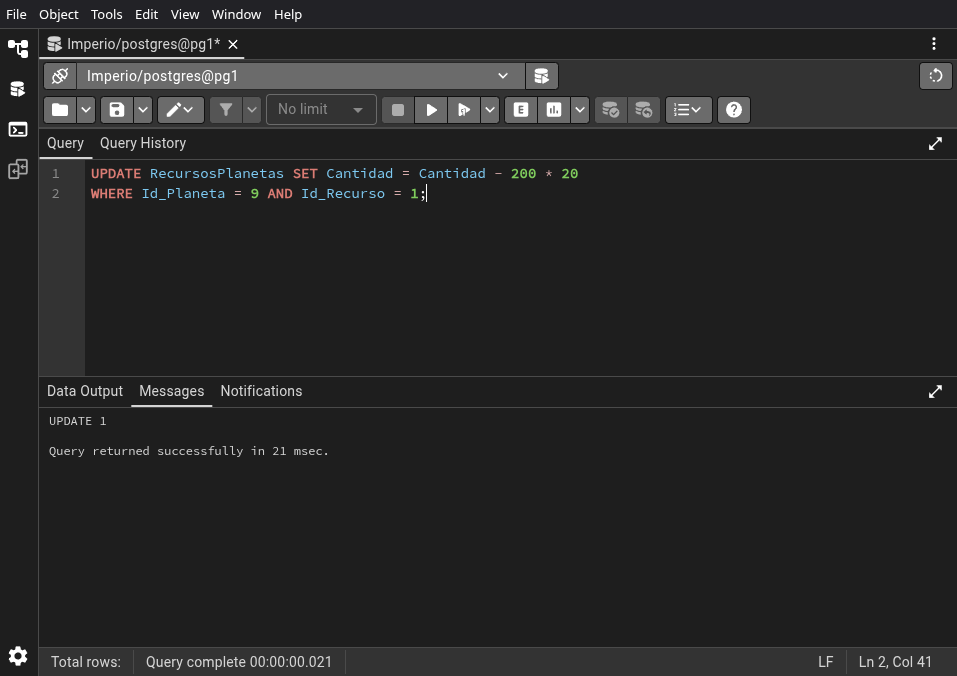
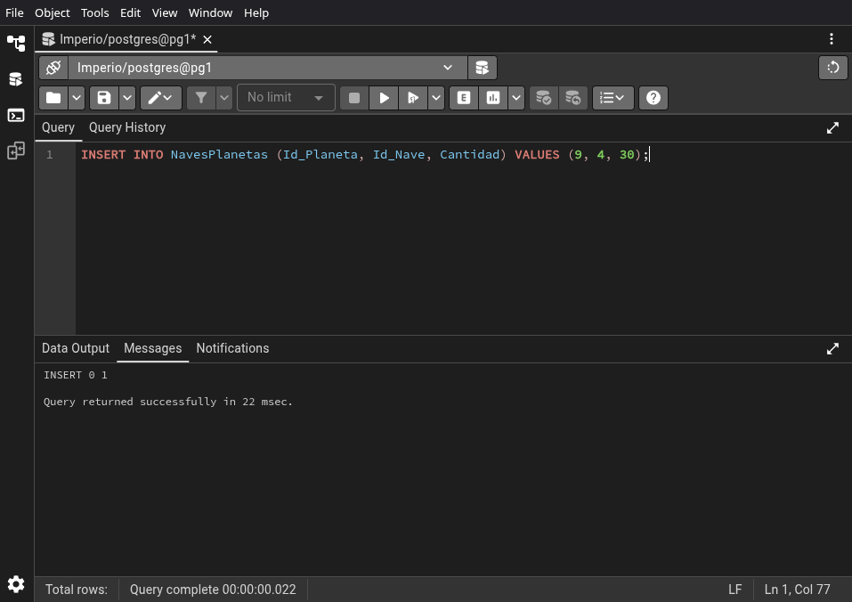

# 03.04-queries


```sql
INSERT INTO NavesPlanetas (Id_Planeta, Id_Nave, Cantidad) VALUES (2, 1, 50);
```


\newpage


```sql
UPDATE RecursosPlanetas SET Cantidad = Cantidad - 100 * 50
WHERE Id_Planeta = 2 AND Id_Recurso = 1;
```


\newpage


```sql
UPDATE RecursosPlanetas SET Cantidad = Cantidad - 50 * 50
WHERE Id_Planeta = 2 AND Id_Recurso = 2;
```


\newpage


```sql
UPDATE RecursosPlanetas SET Cantidad = Cantidad - 30 * 50
WHERE Id_Planeta = 2 AND Id_Recurso = 3;
```


\newpage


```sql
INSERT INTO NavesPlanetas (Id_Planeta, Id_Nave, Cantidad) VALUES (2, 3, 20);
```


\newpage


```sql
UPDATE RecursosPlanetas SET Cantidad = Cantidad - 150 * 20
WHERE Id_Planeta = 2 AND Id_Recurso = 1;
```


\newpage


```sql
UPDATE RecursosPlanetas SET Cantidad = Cantidad - 80 * 20
WHERE Id_Planeta = 2 AND Id_Recurso = 2;
```


\newpage


```sql
UPDATE RecursosPlanetas SET Cantidad = Cantidad - 100 * 20
WHERE Id_Planeta = 2 AND Id_Recurso = 3;
```


\newpage


```sql
INSERT INTO NavesPlanetas (Id_Planeta, Id_Nave, Cantidad) VALUES (2, 4, 30);
```


\newpage


```sql
UPDATE RecursosPlanetas SET Cantidad = Cantidad - 80 * 30
WHERE Id_Planeta = 2 AND Id_Recurso = 1;
```


\newpage


```sql
UPDATE RecursosPlanetas SET Cantidad = Cantidad - 120 * 30
WHERE Id_Planeta = 2 AND Id_Recurso = 2;
```


\newpage


```sql
UPDATE RecursosPlanetas SET Cantidad = Cantidad - 50 * 30
WHERE Id_Planeta = 2 AND Id_Recurso = 3;
```


\newpage


```sql
INSERT INTO NavesPlanetas (Id_Planeta, Id_Nave, Cantidad) VALUES (7, 1, 25);
```


\newpage


```sql
UPDATE RecursosPlanetas SET Cantidad = Cantidad - 100 * 25
WHERE Id_Planeta = 7 AND Id_Recurso = 1;
```


\newpage


```sql
UPDATE RecursosPlanetas SET Cantidad = Cantidad - 50 * 25
WHERE Id_Planeta = 7 AND Id_Recurso = 2;
```


\newpage


```sql
UPDATE RecursosPlanetas SET Cantidad = Cantidad - 30 * 25
WHERE Id_Planeta = 7 AND Id_Recurso = 3;
```


\newpage


```sql
INSERT INTO NavesPlanetas (Id_Planeta, Id_Nave, Cantidad) VALUES (7, 2, 30);
```


\newpage


```sql
UPDATE RecursosPlanetas SET Cantidad = Cantidad - 200 * 30
WHERE Id_Planeta = 7 AND Id_Recurso = 1;
```


\newpage


```sql
UPDATE RecursosPlanetas SET Cantidad = Cantidad - 100 * 30
WHERE Id_Planeta = 7 AND Id_Recurso = 2;
```



\newpage


```sql
UPDATE RecursosPlanetas SET Cantidad = Cantidad - 150 * 30
WHERE Id_Planeta = 7 AND Id_Recurso = 3;
```


\newpage


```sql
INSERT INTO NavesPlanetas (Id_Planeta, Id_Nave, Cantidad) VALUES (7, 5, 15);
```


\newpage


```sql
UPDATE RecursosPlanetas SET Cantidad = Cantidad - 120 * 15
WHERE Id_Planeta = 7 AND Id_Recurso = 1;
```


\newpage


```sql
UPDATE RecursosPlanetas SET Cantidad = Cantidad - 70 * 15
WHERE Id_Planeta = 7 AND Id_Recurso = 2;
```



\newpage


```sql
UPDATE RecursosPlanetas SET Cantidad = Cantidad - 90 * 15
WHERE Id_Planeta = 7 AND Id_Recurso = 3;
```


\newpage


```sql
INSERT INTO NavesPlanetas (Id_Planeta, Id_Nave, Cantidad) VALUES (9, 2, 20);
```


\newpage


```sql
UPDATE RecursosPlanetas SET Cantidad = Cantidad - 200 * 20
WHERE Id_Planeta = 9 AND Id_Recurso = 1;
```



\newpage


```sql
UPDATE RecursosPlanetas SET Cantidad = Cantidad - 100 * 20
WHERE Id_Planeta = 9 AND Id_Recurso = 2;
```


\newpage


```sql
UPDATE RecursosPlanetas SET Cantidad = Cantidad - 150 * 20
WHERE Id_Planeta = 9 AND Id_Recurso = 3;
```


\newpage


```sql
INSERT INTO NavesPlanetas (Id_Planeta, Id_Nave, Cantidad) VALUES (9, 4, 30);
```



\newpage


```sql
UPDATE RecursosPlanetas SET Cantidad = Cantidad - 80 * 30
WHERE Id_Planeta = 9 AND Id_Recurso = 1;
```


\newpage


```sql
UPDATE RecursosPlanetas SET Cantidad = Cantidad - 120 * 30
WHERE Id_Planeta = 9 AND Id_Recurso = 2;
```


\newpage


```sql
UPDATE RecursosPlanetas SET Cantidad = Cantidad - 50 * 30
WHERE Id_Planeta = 9 AND Id_Recurso = 3;
```


\newpage


```sql
INSERT INTO NavesPlanetas (Id_Planeta, Id_Nave, Cantidad) VALUES (9, 5, 10);
```


\newpage


```sql
UPDATE RecursosPlanetas SET Cantidad = Cantidad - 120 * 10
WHERE Id_Planeta = 9 AND Id_Recurso = 1;
```


\newpage


```sql
UPDATE RecursosPlanetas SET Cantidad = Cantidad - 70 * 10
WHERE Id_Planeta = 9 AND Id_Recurso = 2;
```


\newpage


```sql
UPDATE RecursosPlanetas SET Cantidad = Cantidad - 90 * 10
WHERE Id_Planeta = 9 AND Id_Recurso = 3;
```


\newpage


