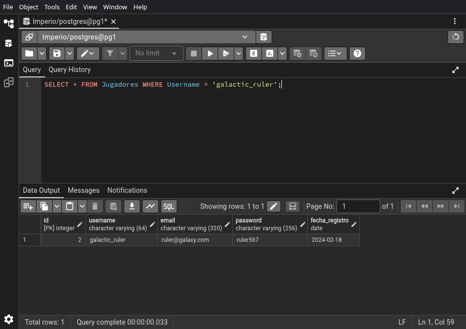
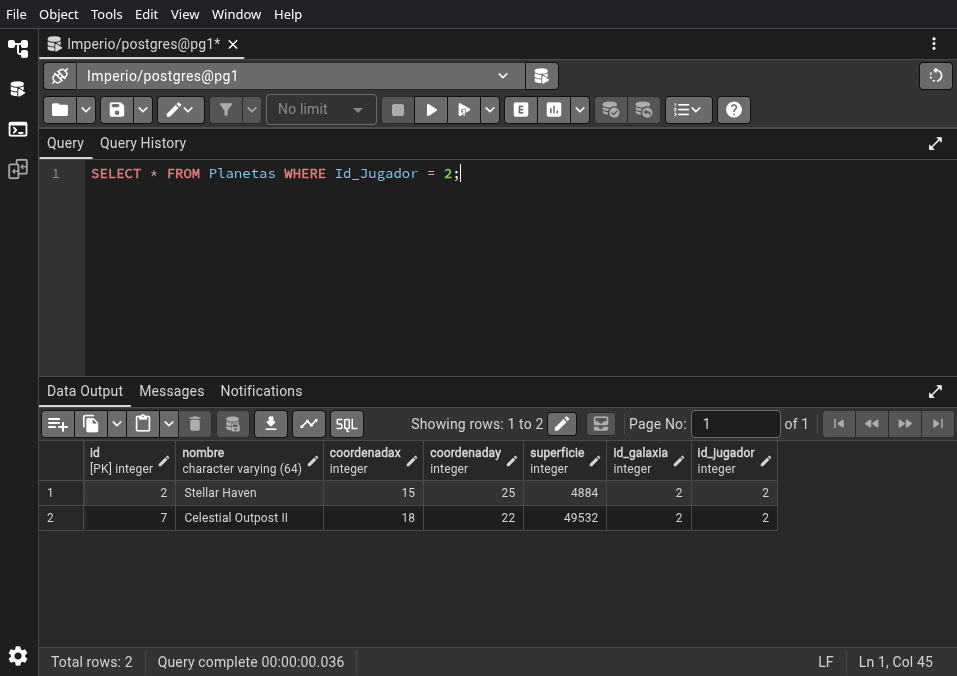
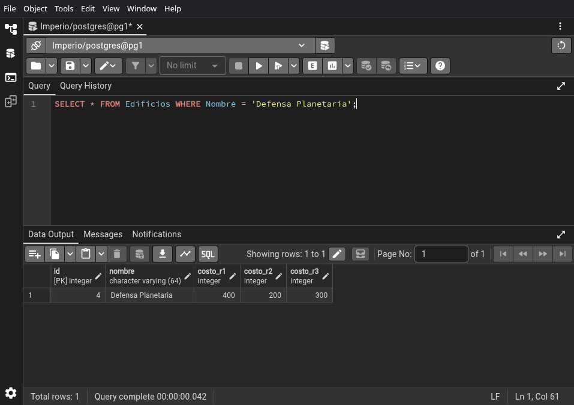
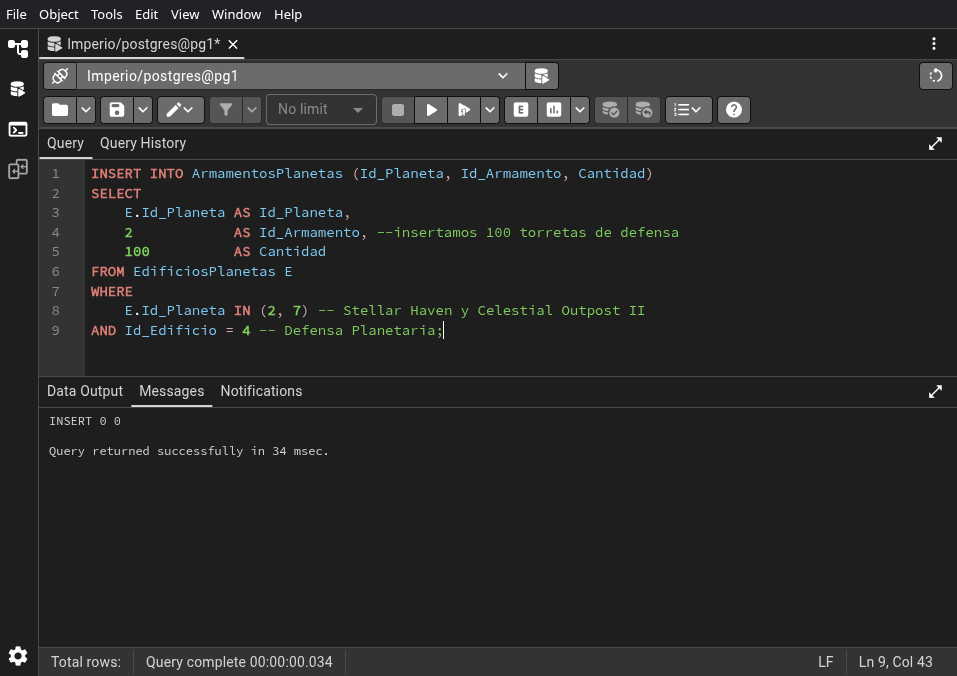

# 03.05-queries

```sql
SELECT * FROM Jugadores WHERE Username = 'galactic_ruler';
```



\newpage

```sql
SELECT * FROM Planetas WHERE Id_Jugador = 2;
```



\newpage

```sql
SELECT * FROM Edificios WHERE Nombre = 'Defensa Planetaria';
```



\newpage

```sql
INSERT INTO ArmamentosPlanetas (Id_Planeta, Id_Armamento, Cantidad)
SELECT
	E.Id_Planeta AS Id_Planeta,
	2			 AS Id_Armamento, --insertamos 100 torretas de defensa
    100          AS Cantidad
FROM EdificiosPlanetas E
WHERE
	E.Id_Planeta IN (2, 7) -- Stellar Haven y Celestial Outpost II
AND Id_Edificio = 4 -- Defensa Planetaria;
```



\newpage
