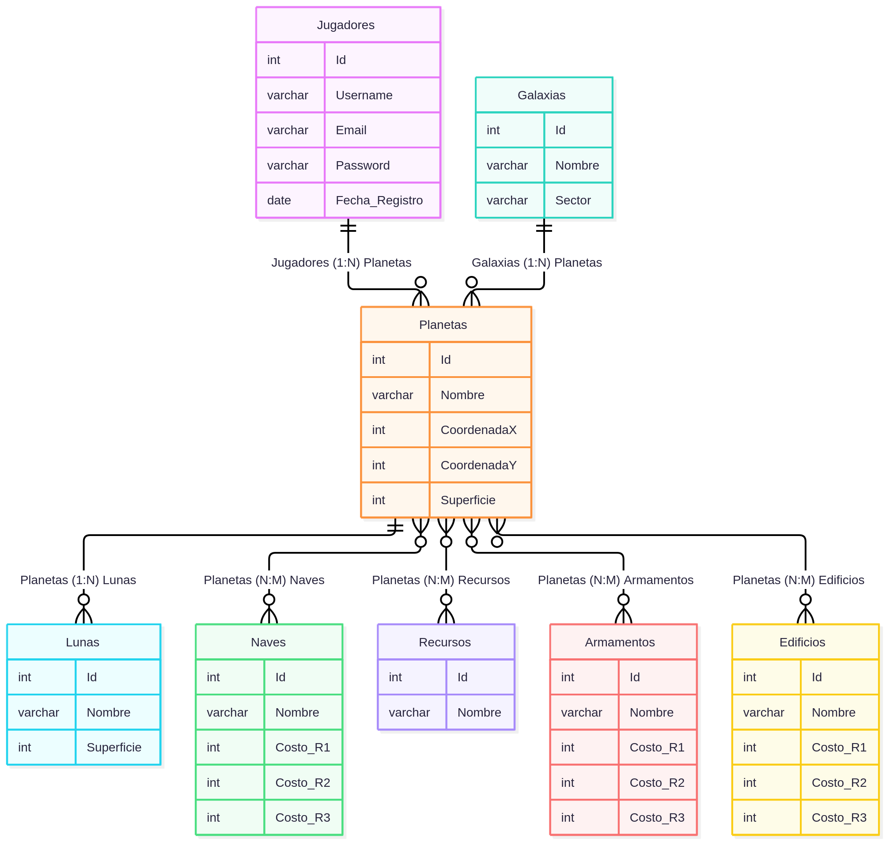
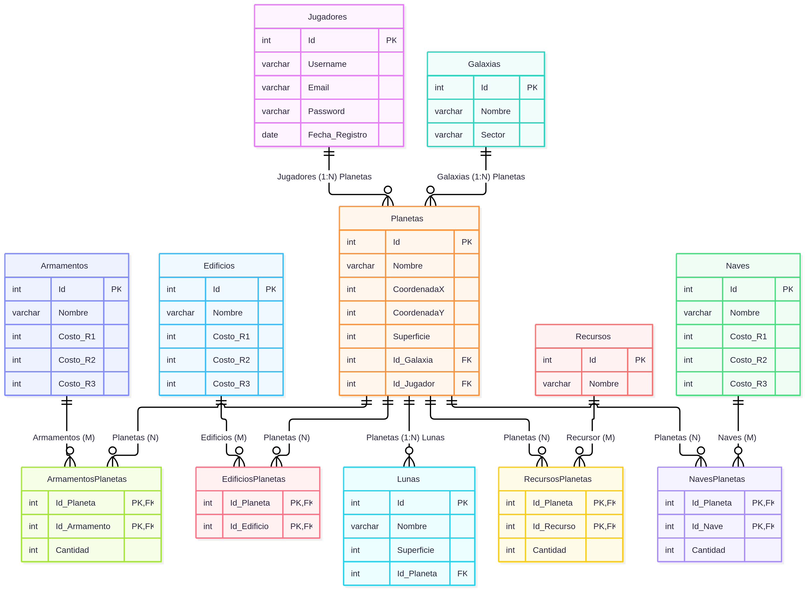

\newpage

# Parcial 1 - Bases de Datos II

Santiago Garabaya, [26-2][ACT3AV] Base de Datos II

## Parte 1: DER y Modelo Lógico

### Diagrama Entidad/Relación (DER)

A partir de la consigna podemos determinar que el DER es:



\newpage

### Modelo Lógico

A partir del DER, podemos refinar el modelo, creando tablas pivote donde sea necesario.



\newpage

## Parte 2

### Parte 2.1: Creación de la Base de Datos

Vamos a implementar el trabajo usando Postgres.

Podemos ejecutar:

```sql
CREATE DATABASE Imperio;
```

O crearla directamente en la UI (pgAdmin).

## Parte 2.2: Creación de las Tablas

### Jugadores

```sql
CREATE TABLE Jugadores (
	Id SERIAL PRIMARY KEY,
	Username VARCHAR(64) NOT NULL UNIQUE,
	Email VARCHAR(320) NOT NULL UNIQUE,
	Password VARCHAR(256) NOT NULL,
	Fecha_Registro DATE NOT NULL
);
```


\newpage

### Galaxias

```sql
CREATE TABLE Galaxias (
	Id SERIAL PRIMARY KEY,
	Nombre VARCHAR(64) NOT NULL UNIQUE,
	Sector VARCHAR(64) NOT NULL
);
```


\newpage

### Planetas

```sql
CREATE TABLE Planetas (
	Id SERIAL PRIMARY KEY,
	Nombre VARCHAR(64) NOT NULL UNIQUE,
	CoordenadaX INT NOT NULL,
	CoordenadaY INT NOT NULL,
	Superficie INT NOT NULL,
	Id_Galaxia INT NOT NULL REFERENCES Galaxias(Id),
	Id_Jugador INT REFERENCES Jugadores(Id),
    UNIQUE (CoordenadaX, CoordenadaY)
);
```


\newpage

### Lunas

```sql
CREATE TABLE Lunas (
	Id SERIAL PRIMARY KEY,
	Nombre VARCHAR(64) NOT NULL UNIQUE,
	Superficie INT NOT NULL,
	Id_Planeta INT NOT NULL REFERENCES Planetas(Id)
);
```


\newpage

### Naves

```sql
CREATE TABLE Naves (
	Id SERIAL PRIMARY KEY,
	Nombre VARCHAR(64) NOT NULL UNIQUE,
	Costo_R1 INT NOT NULL,
	Costo_R2 INT NOT NULL,
	Costo_R3 INT NOT NULL
);
```


\newpage

### NavesPlanetas (tabla pivote)

```sql
CREATE TABLE NavesPlanetas (
	Id_Planeta INT NOT NULL REFERENCES Planetas(Id),
	Id_Nave INT NOT NULL REFERENCES Naves(Id),
	Cantidad INT DEFAULT 0,
	PRIMARY KEY(Id_Planeta, Id_Nave)
);
```


\newpage

### Recursos

```sql
CREATE TABLE Recursos (
	Id SERIAL PRIMARY KEY,
	Nombre VARCHAR(64) NOT NULL UNIQUE
);
```


\newpage

### RecursosPlanetas (tabla pivote)

```sql
CREATE TABLE RecursosPlanetas (
    Id_Planeta INT NOT NULL REFERENCES Planetas(Id),
    Id_Recurso INT NOT NULL REFERENCES Recursos(Id),
    Cantidad INT DEFAULT 0,
    PRIMARY KEY (Id_Planeta, Id_Recurso)
);
```


\newpage

### Armamentos

```sql
CREATE TABLE Armamentos (
	Id SERIAL PRIMARY KEY,
	Nombre VARCHAR(64) NOT NULL UNIQUE,
	Costo_R1 INT NOT NULL,
	Costo_R2 INT NOT NULL,
	Costo_R3 INT NOT NULL
);
```


\newpage

### ArmamentosPlanetas (tabla pivote)

```sql
CREATE TABLE ArmamentosPlanetas (
    Id_Planeta INT NOT NULL REFERENCES Planetas(Id),
    Id_Armamento INT NOT NULL REFERENCES Armamentos(Id),
    Cantidad INT DEFAULT 0,
    PRIMARY KEY(Id_Planeta, Id_Armamento)
);
```


\newpage

### Edificios

```sql
CREATE TABLE Edificios (
	Id SERIAL PRIMARY KEY,
	Nombre VARCHAR(64) NOT NULL UNIQUE,
	Costo_R1 INT NOT NULL,
	Costo_R2 INT NOT NULL,
	Costo_R3 INT NOT NULL
);
```


\newpage

### EdificiosPlanetas (tabla pivote)

```sql
CREATE TABLE EdificiosPlanetas (
    Id_Planeta INT NOT NULL REFERENCES Planetas(Id),
    Id_Edificio INT NOT NULL REFERENCES Edificios(Id),
    PRIMARY KEY(Id_Planeta, Id_Edificio)
);
```


\newpage

## Parte 2.2: Insercion de datos

### Jugadores

Las queries de insercion seran con este formato:

```sql
INSERT INTO Jugadores
    (Username, Email, Password, Fecha_Registro)
VALUES
    (?, ?, ?, ?);
```

### Datos Jugadores:

| Username        | Email                 | Password   | Fecha_Registro |
| --------------- | --------------------- | ---------- | -------------- |
| astro_gamer     | astro_gamer@email.com | estelar123 | 2024-02-18     |
| galactic_ruler  | ruler@galaxy.com      | ruler567   | 2024-02-18     |
| cosmic_explorer | explorer@universe.com | explore321 | 2024-02-18     |
| space_commander | commander@space.com   | command789 | 2024-02-18     |
| stargazer       | stargazer@gmail.com   | star1234   | 2024-02-18     |
| space_pioneer   | pioneer@email.com     | pioneer123 | 2024-02-18     |

\newpage

```sql
INSERT INTO Jugadores (Username, Email, Password, Fecha_Registro)
VALUES ('astro_gamer', 'astro_gamer@email.com', 'estelar123', '2024-02-18');
```


\newpage

```sql
INSERT INTO Jugadores (Username, Email, Password, Fecha_Registro)
VALUES ('galactic_ruler', 'ruler@galaxy.com', 'ruler567', '2024-02-18');
```


\newpage

```sql
INSERT INTO Jugadores (Username, Email, Password, Fecha_Registro)
VALUES ('cosmic_explorer', 'explorer@universe.com', 'explore321', '2024-02-18');
```


\newpage

```sql
INSERT INTO Jugadores (Username, Email, Password, Fecha_Registro)
VALUES ('space_commander', 'commander@space.com', 'command789', '2024-02-18');
```


\newpage

```sql
INSERT INTO Jugadores (Username, Email, Password, Fecha_Registro)
VALUES ('stargazer', 'stargazer@gmail.com', 'star1234', '2024-02-18');
```


\newpage

```sql
INSERT INTO Jugadores (Username, Email, Password, Fecha_Registro)
VALUES ('space_pioneer', 'pioneer@email.com', 'pioneer123', '2024-02-18');
```


\newpage

### Galaxias

Las queries de insercion seran con este formato:

```sql
INSERT INTO Galaxias (Nombre, Sector)
VALUES (?, ?);
```

### Datos Galaxias:

| Nombre    | Sector  |
| --------- | ------- |
| Milky Way | Alpha   |
| Andromeda | Beta    |
| Pegasus   | Gamma   |
| Orion     | Delta   |
| Centaurus | Epsilon |

\newpage

```sql
INSERT INTO Galaxias (Nombre, Sector)
VALUES ('Milky Way', 'Alpha');
```


\newpage

```sql
INSERT INTO Galaxias (Nombre, Sector)
VALUES ('Andromeda', 'Beta');
```


\newpage

```sql
INSERT INTO Galaxias (Nombre, Sector)
VALUES ('Pegasus', 'Gamma');
```


\newpage

```sql
INSERT INTO Galaxias (Nombre, Sector)
VALUES ('Orion', 'Delta');
```


\newpage

```sql
INSERT INTO Galaxias (Nombre, Sector)
VALUES ('Centaurus', 'Epsilon');
```


\newpage

### Planetas

Las queries de insercion seran con este formato:

```sql
INSERT INTO Planetas
    (Nombre, CoordenadaX, CoordenadaY, Superficie, Id_Galaxia)
VALUES (?, ?, ?, ?, ?);
```

### Datos Galaxias:

| Nombre               | CoordenadaX | CoordenadaY | Superficie | ID_Galaxia |
| -------------------- | ----------- | ----------- | ---------- | ---------- |
| Nova Prime           | 10          | 20          | 108728     | 1          |
| Stellar Haven        | 15          | 25          | 4884       | 2          |
| Astral Oasis         | 8           | 30          | 142984     | 1          |
| Celestial Outpost    | 12          | 18          | 9452       | 3          |
| Galactic Citadel     | 25          | 15          | 51118      | 4          |
| Starlight Sanctuary  | 5           | 12          | 7534       | 1          |
| Celestial Outpost II | 18          | 22          | 49532      | 2          |
| Nebula Nexus         | 30          | 8           | 6794       | 3          |
| Solar Haven          | 10          | 30          | 12756      | 1          |
| Asteroid Haven       | 22          | 17          | 12104      | 4          |

\newpage

```sql
INSERT INTO Planetas (Nombre, CoordenadaX, CoordenadaY, Superficie, Id_Galaxia)
VALUES ('Nova Prime', 10, 20, 108728, 1);
```


\newpage

```sql
INSERT INTO Planetas (Nombre, CoordenadaX, CoordenadaY, Superficie, Id_Galaxia)
VALUES ('Stellar Haven', 15, 25, 4884, 2);
```


\newpage

```sql
INSERT INTO Planetas (Nombre, CoordenadaX, CoordenadaY, Superficie, Id_Galaxia)
VALUES ('Astral Oasis', 8, 30, 142984, 1);
```


\newpage

```sql
INSERT INTO Planetas (Nombre, CoordenadaX, CoordenadaY, Superficie, Id_Galaxia)
VALUES ('Celestial Outpost', 12, 18, 9452, 3);
```


\newpage

```sql
INSERT INTO Planetas (Nombre, CoordenadaX, CoordenadaY, Superficie, Id_Galaxia)
VALUES ('Galactic Citadel', 25, 15, 51118, 4);
```


\newpage

```sql
INSERT INTO Planetas (Nombre, CoordenadaX, CoordenadaY, Superficie, Id_Galaxia)
VALUES ('Starlight Sanctuary', 5, 12, 7534, 1);
```


\newpage

```sql
INSERT INTO Planetas (Nombre, CoordenadaX, CoordenadaY, Superficie, Id_Galaxia)
VALUES ('Celestial Outpost II', 18, 22, 49532, 2);
```


\newpage

```sql
INSERT INTO Planetas (Nombre, CoordenadaX, CoordenadaY, Superficie, Id_Galaxia)
VALUES ('Nebula Nexus', 30, 8, 6794, 3);
```


\newpage

```sql
INSERT INTO Planetas (Nombre, CoordenadaX, CoordenadaY, Superficie, Id_Galaxia)
VALUES ('Solar Haven', 10, 30, 12756, 1);
```


\newpage

```sql
INSERT INTO Planetas (Nombre, CoordenadaX, CoordenadaY, Superficie, Id_Galaxia)
VALUES ('Asteroid Haven', 22, 17, 12104, 4);
```


\newpage

### Lunas

Las queries de insercion seran con este formato:

```sql
INSERT INTO Lunas (Nombre, Superficie, Id_Planeta)
VALUES (?, ?, ?);
```

### Datos Lunas:

| Nombre            | Superficie | ID_Planeta |
| ----------------- | ---------- | ---------- |
| Luminara          | 1524       | 1          |
| Nightshade        | 1289       | 2          |
| Galaxysong        | 1811       | 3          |
| StellarDust       | 2037       | 4          |
| MoonlightGrove    | 1699       | 5          |
| GlimmeringOrbit   | 1387       | 1          |
| EclipseHarbor     | 1114       | 2          |
| MoonstoneMeadow   | 1532       | 3          |
| StellarRefuge     | 1844       | 4          |
| CosmicSerenity    | 1656       | 5          |
| Luminara II       | 1457       | 6          |
| Nightshade II     | 1228       | 7          |
| Galaxysong II     | 1791       | 8          |
| StellarDust II    | 2033       | 9          |
| MoonlightGrove II | 1578       | 10         |

\newpage

```sql
INSERT INTO Lunas (Nombre, Superficie, Id_Planeta)
VALUES ('Luminara', 1524, 1);
```


\newpage

```sql
INSERT INTO Lunas (Nombre, Superficie, Id_Planeta)
VALUES ('Nightshade', 1289, 2);
```


\newpage

```sql
INSERT INTO Lunas (Nombre, Superficie, Id_Planeta)
VALUES ('Galaxysong', 1811, 3);
```


\newpage

```sql
INSERT INTO Lunas (Nombre, Superficie, Id_Planeta)
VALUES ('StellarDust', 2037, 4);
```


\newpage

```sql
INSERT INTO Lunas (Nombre, Superficie, Id_Planeta)
VALUES ('MoonlightGrove', 1699, 5);
```


\newpage

```sql
INSERT INTO Lunas (Nombre, Superficie, Id_Planeta)
VALUES ('GlimmeringOrbit', 1387, 1);
```


\newpage

```sql
INSERT INTO Lunas (Nombre, Superficie, Id_Planeta)
VALUES ('EclipseHarbor', 1114, 2);
```


\newpage

```sql
INSERT INTO Lunas (Nombre, Superficie, Id_Planeta)
VALUES ('MoonstoneMeadow', 1532, 3);
```


\newpage

```sql
INSERT INTO Lunas (Nombre, Superficie, Id_Planeta)
VALUES ('StellarRefuge', 1844, 4);
```


\newpage

```sql
INSERT INTO Lunas (Nombre, Superficie, Id_Planeta)
VALUES ('CosmicSerenity', 1656, 5);
```


\newpage

```sql
INSERT INTO Lunas (Nombre, Superficie, Id_Planeta)
VALUES ('Luminara II', 1457, 6);
```


\newpage

```sql
INSERT INTO Lunas (Nombre, Superficie, Id_Planeta)
VALUES ('Nightshade II', 1228, 7);
```


\newpage

```sql
INSERT INTO Lunas (Nombre, Superficie, Id_Planeta)
VALUES ('Galaxysong II', 1791, 8);
```


\newpage

```sql
INSERT INTO Lunas (Nombre, Superficie, Id_Planeta)
VALUES ('StellarDust II', 2033, 9);
```


\newpage

```sql
INSERT INTO Lunas (Nombre, Superficie, Id_Planeta)
VALUES ('MoonlightGrove II', 1578, 10);
```


\newpage

### Naves

Las queries de insercion seran con este formato:

```sql
INSERT INTO Naves
    (Nombre, Costo_R1, Costo_R2, Costo_R3)
VALUES
    (?, ?, ?, ?);
```

### Datos:

| Nombre                     | Costo_R1 | Costo_R2 | Costo_R3 |
| -------------------------- | -------- | -------- | -------- |
| Caza Estelar               | 100      | 50       | 30       |
| Destructor Interplanetario | 200      | 100      | 150      |
| Nave de Colonización       | 150      | 80       | 100      |
| Transportador de Recursos  | 80       | 120      | 50       |
| Nave de Exploración        | 120      | 70       | 90       |

\newpage

```sql
INSERT INTO Naves (Nombre, Costo_R1, Costo_R2, Costo_R3)
VALUES ('Caza Estelar', 100, 50, 30);
```


\newpage

```sql
INSERT INTO Naves (Nombre, Costo_R1, Costo_R2, Costo_R3)
VALUES ('Destructor Interplanetario', 200, 100, 150);
```


\newpage

```sql
INSERT INTO Naves (Nombre, Costo_R1, Costo_R2, Costo_R3)
VALUES ('Nave de Colonización', 150, 80, 100);
```


\newpage

```sql
INSERT INTO Naves (Nombre, Costo_R1, Costo_R2, Costo_R3)
VALUES ('Transportador de Recursos', 80, 120, 50);
```


\newpage

```sql
INSERT INTO Naves (Nombre, Costo_R1, Costo_R2, Costo_R3)
VALUES ('Nave de Exploración', 120, 70, 90);
```


\newpage

### Recursos

Las queries de insercion seran con este formato:

```sql
INSERT INTO Recursos (Nombre) VALUES (?);
```

### Datos:

| Nombre   |
| -------- |
| Metal    |
| Deuterio |
| Energia  |

\newpage

```sql
INSERT INTO Recursos (Nombre) VALUES ('Metal');
```


\newpage

```sql
INSERT INTO Recursos (Nombre) VALUES ('Deuterio');
```


\newpage

```sql
INSERT INTO Recursos (Nombre) VALUES ('Energía');
```


\newpage

### Armamentos

Las queries de insercion seran con este formato:

```sql
INSERT INTO Armamentos (Nombre, Costo_R1, Costo_R2, Costo_R3)
VALUES (?, ?, ?, ?);
```

### Datos:

| Nombre             | Costo_R1 | Costo_R2 | Costo_R3 |
| ------------------ | -------- | -------- | -------- |
| Cañón de Plasma    | 150      | 100      | 80       |
| Torreta de Defensa | 100      | 80       | 120      |
| Láser de Precisión | 120      | 150      | 100      |
| Bomba de Neutrinos | 80       | 120      | 150      |
| Escudo de Energía  | 100      | 150      | 80       |

\newpage

```sql
INSERT INTO Armamentos (Nombre, Costo_R1, Costo_R2, Costo_R3)
VALUES ('Cañón de Plasma', 150, 100, 80);
```


\newpage

```sql
INSERT INTO Armamentos (Nombre, Costo_R1, Costo_R2, Costo_R3)
VALUES ('Torreta de Defensa', 100, 80, 120);
```


\newpage

```sql
INSERT INTO Armamentos (Nombre, Costo_R1, Costo_R2, Costo_R3)
VALUES ('Láser de Precisión', 120, 150, 100);
```


\newpage

```sql
INSERT INTO Armamentos (Nombre, Costo_R1, Costo_R2, Costo_R3)
VALUES ('Bomba de Neutrinos', 80, 120, 150);
```


\newpage

```sql
INSERT INTO Armamentos (Nombre, Costo_R1, Costo_R2, Costo_R3)
VALUES ('Escudo de Energía', 100, 150, 80);
```


\newpage

### Edificios

Las queries de insercion seran con este formato:

```sql
INSERT INTO Edificios (Nombre, Costo_R1, Costo_R2, Costo_R3)
VALUES (?, ?, ?, ?);
```

### Datos:

| Nombre                   | Costo_R1 | Costo_R2 | Costo_R3 |
| ------------------------ | -------- | -------- | -------- |
| Centro de Investigación  | 500      | 200      | 300      |
| Hangar de Naves          | 300      | 400      | 200      |
| Planta de Energía Solar  | 200      | 300      | 500      |
| Defensa Planetaria       | 400      | 200      | 300      |
| Puerto Espacial          | 300      | 500      | 200      |
| Sintetizador de Deuterio | 250      | 400      | 150      |
| Almacén de Metales       | 150      | 250      | 100      |

\newpage

```sql
INSERT INTO Edificios (Nombre, Costo_R1, Costo_R2, Costo_R3)
VALUES ('Centro de Investigación', 500, 200, 300);
```


\newpage

```sql
INSERT INTO Edificios (Nombre, Costo_R1, Costo_R2, Costo_R3)
VALUES ('Hangar de Naves', 300, 400, 200);
```


\newpage

```sql
INSERT INTO Edificios (Nombre, Costo_R1, Costo_R2, Costo_R3)
VALUES ('Planta de Energía Solar', 200, 300, 500);
```


\newpage

```sql
INSERT INTO Edificios (Nombre, Costo_R1, Costo_R2, Costo_R3)
VALUES ('Defensa Planetaria', 400, 200, 300);
```


\newpage

```sql
INSERT INTO Edificios (Nombre, Costo_R1, Costo_R2, Costo_R3)
VALUES ('Puerto Espacial', 300, 500, 200);
```


\newpage

```sql
INSERT INTO Edificios (Nombre, Costo_R1, Costo_R2, Costo_R3)
VALUES ('Sintetizador de Deuterio', 250, 400, 150);
```


\newpage

```sql
INSERT INTO Edificios (Nombre, Costo_R1, Costo_R2, Costo_R3)
VALUES ('Almacén de Metales', 150, 250, 100);
```


\newpage

## Parte 3: Insercion de Datos

### Parte 3.1 Asignacion de Planetas a Jugadores

'Nova Prime' -> 'astro_gamer'

```sql
UPDATE Planetas SET Id_Jugador = 1 WHERE Id = 1;
```


\newpage

'Astral Oasis' -> 'astro_gamer'

```sql
UPDATE Planetas SET Id_Jugador = 1 WHERE Id = 3;
```


\newpage

'Starlight Sanctuary' -> 'astro_gamer'

```sql
UPDATE Planetas SET Id_Jugador = 1 WHERE Id = 6;
```


\newpage

'Stellar Haven' -> 'galactic_ruler'

```sql
UPDATE Planetas SET Id_Jugador = 2 WHERE Id = 2;
```


\newpage

'Celestial Outpost II' -> 'galactic_ruler'

```sql
UPDATE Planetas SET Id_Jugador = 2 WHERE Id = 7;
```


\newpage

'Nebula Nexus' -> 'cosmic_explorer'

```sql
UPDATE Planetas SET Id_Jugador = 3 WHERE Id = 8;
```


\newpage

'Celestial Outpost' -> 'space_commander'

```sql
UPDATE Planetas SET Id_Jugador = 4 WHERE Id = 4;
```


\newpage

'Asteroid Haven' -> 'space_commander'

```sql
UPDATE Planetas SET Id_Jugador = 4 WHERE Id = 10;
```


\newpage

'Galactic Citadel' -> 'stargazer'

```sql
UPDATE Planetas SET Id_Jugador = 5 WHERE Id = 5;
```


\newpage

'Solar Haven' -> 'space_pioneer'

```sql
UPDATE Planetas SET Id_Jugador = 6 WHERE Id = 9;
```


\newpage

### Parte 3.2 Recursos Iniciales

Todos los planetas tienen:

| Recurso  | Cantidad |
| -------- | -------- |
| Metal    | 500000   |
| Deuterio | 23000    |
| Energía  | 25000    |

\newpage

```sql
INSERT INTO RecursosPlanetas (Id_Planeta, Id_Recurso, Cantidad) VALUES (1, 1, 500000);
```


\newpage

```sql
INSERT INTO RecursosPlanetas (Id_Planeta, Id_Recurso, Cantidad) VALUES (1, 2, 23000);
```


\newpage

```sql
INSERT INTO RecursosPlanetas (Id_Planeta, Id_Recurso, Cantidad) VALUES (1, 3, 25000);
```


\newpage

```sql
INSERT INTO RecursosPlanetas (Id_Planeta, Id_Recurso, Cantidad) VALUES (2, 1, 500000);
```


\newpage

```sql
INSERT INTO RecursosPlanetas (Id_Planeta, Id_Recurso, Cantidad) VALUES (2, 2, 23000);
```


\newpage

```sql
INSERT INTO RecursosPlanetas (Id_Planeta, Id_Recurso, Cantidad) VALUES (2, 3, 25000);
```


\newpage

```sql
INSERT INTO RecursosPlanetas (Id_Planeta, Id_Recurso, Cantidad) VALUES (3, 1, 500000);
```


\newpage

```sql
INSERT INTO RecursosPlanetas (Id_Planeta, Id_Recurso, Cantidad) VALUES (3, 2, 23000);
```


\newpage

```sql
INSERT INTO RecursosPlanetas (Id_Planeta, Id_Recurso, Cantidad) VALUES (3, 3, 25000);
```


\newpage

```sql
INSERT INTO RecursosPlanetas (Id_Planeta, Id_Recurso, Cantidad) VALUES (4, 1, 500000);
```


\newpage

```sql
INSERT INTO RecursosPlanetas (Id_Planeta, Id_Recurso, Cantidad) VALUES (4, 2, 23000);
```


\newpage

```sql
INSERT INTO RecursosPlanetas (Id_Planeta, Id_Recurso, Cantidad) VALUES (4, 3, 25000);
```


\newpage

```sql
INSERT INTO RecursosPlanetas (Id_Planeta, Id_Recurso, Cantidad) VALUES (5, 1, 500000);
```


\newpage

```sql
INSERT INTO RecursosPlanetas (Id_Planeta, Id_Recurso, Cantidad) VALUES (5, 2, 23000);
```


\newpage

```sql
INSERT INTO RecursosPlanetas (Id_Planeta, Id_Recurso, Cantidad) VALUES (5, 3, 25000);
```


\newpage

```sql
INSERT INTO RecursosPlanetas (Id_Planeta, Id_Recurso, Cantidad) VALUES (6, 1, 500000);
```


\newpage

```sql
INSERT INTO RecursosPlanetas (Id_Planeta, Id_Recurso, Cantidad) VALUES (6, 2, 23000);
```


\newpage

```sql
INSERT INTO RecursosPlanetas (Id_Planeta, Id_Recurso, Cantidad) VALUES (6, 3, 25000);
```


\newpage

```sql
INSERT INTO RecursosPlanetas (Id_Planeta, Id_Recurso, Cantidad) VALUES (7, 1, 500000);
```


\newpage

```sql
INSERT INTO RecursosPlanetas (Id_Planeta, Id_Recurso, Cantidad) VALUES (7, 2, 23000);
```


\newpage

```sql
INSERT INTO RecursosPlanetas (Id_Planeta, Id_Recurso, Cantidad) VALUES (7, 3, 25000);
```


\newpage

```sql
INSERT INTO RecursosPlanetas (Id_Planeta, Id_Recurso, Cantidad) VALUES (8, 1, 500000);
```


\newpage

```sql
INSERT INTO RecursosPlanetas (Id_Planeta, Id_Recurso, Cantidad) VALUES (8, 2, 23000);
```


\newpage

```sql
INSERT INTO RecursosPlanetas (Id_Planeta, Id_Recurso, Cantidad) VALUES (8, 3, 25000);
```


\newpage

```sql
INSERT INTO RecursosPlanetas (Id_Planeta, Id_Recurso, Cantidad) VALUES (9, 1, 500000);
```


\newpage

```sql
INSERT INTO RecursosPlanetas (Id_Planeta, Id_Recurso, Cantidad) VALUES (9, 2, 23000);
```


\newpage

```sql
INSERT INTO RecursosPlanetas (Id_Planeta, Id_Recurso, Cantidad) VALUES (9, 3, 25000);
```


\newpage

```sql
INSERT INTO RecursosPlanetas (Id_Planeta, Id_Recurso, Cantidad) VALUES (10, 1, 500000);
```


\newpage

```sql
INSERT INTO RecursosPlanetas (Id_Planeta, Id_Recurso, Cantidad) VALUES (10, 2, 23000);
```


\newpage

```sql
INSERT INTO RecursosPlanetas (Id_Planeta, Id_Recurso, Cantidad) VALUES (10, 3, 25000);
```


\newpage

### Parte 3.3 Asignacion de Edificios a Planetas

#### Formato:

```sql
INSERT INTO EdificiosPlanetas (Id_Planeta, Id_Edificio) VALUES (?, ?);

UPDATE RecursosPlanetas SET Cantidad = Cantidad - ?
WHERE Id_Planeta = ? AND Id_Recurso = 1;

UPDATE RecursosPlanetas SET Cantidad = Cantidad - ?
WHERE Id_Planeta = ? AND Id_Recurso = 2;

UPDATE RecursosPlanetas SET Cantidad = Cantidad - ?
WHERE Id_Planeta = ? AND Id_Recurso = 3;
```

Son 4 queries por Edificio, ya que al construir el edificio tenemos que pagar el costo en recursos.

#### Datos:

| Planeta              | Edificio                 | Costo R1 | Costo R2 | Costo R3 |
| -------------------- | ------------------------ | -------- | -------- | -------- |
| Nova Prime           | Centro de Investigacion  | 500      | 200      | 300      |
| Nova Prime           | Puerto Espacial          | 300      | 500      | 200      |
| Stellar Haven        | Hangar de Naves          | 300      | 400      | 200      |
| Stellar Haven        | Defensa Planetaria       | 400      | 200      | 300      |
| Stellar Haven        | Sintetizador de Deuterio | 250      | 400      | 150      |
| Astral Oasis         | Hangar de Naves          | 300      | 400      | 200      |
| Astral Oasis         | Planta de Energia Solar  | 200      | 300      | 500      |
| Celestial Outpost    | Planta de Energia Solar  | 200      | 300      | 500      |
| Celestial Outpost    | Defensa Planetaria       | 400      | 200      | 300      |
| Galactic Citadel     | Centro de Investigacion  | 500      | 200      | 300      |
| Galactic Citadel     | Hangar de Naves          | 300      | 400      | 200      |
| Starlight Sanctuary  | Centro de Investigacion  | 500      | 200      | 300      |
| Starlight Sanctuary  | Puerto Espacial          | 300      | 500      | 200      |
| Celestial Outpost II | Hangar de Naves          | 300      | 400      | 200      |
| Celestial Outpost II | Planta de Energia Solar  | 200      | 300      | 500      |
| Nebula Nexus         | Centro de Investigacion  | 500      | 200      | 300      |
| Nebula Nexus         | Sintetizador de Deuterio | 250      | 400      | 150      |
| Solar Haven          | Hangar de Naves          | 300      | 400      | 200      |
| Solar Haven          | Defensa Planetaria       | 400      | 200      | 300      |
| Solar Haven          | Puerto Espacial          | 300      | 500      | 200      |
| Asteroid Haven       | Centro de Investigacion  | 500      | 200      | 300      |
| Asteroid Haven       | Planta de Energia Solar  | 200      | 300      | 500      |

\newpage

```sql
INSERT INTO EdificiosPlanetas (Id_Planeta, Id_Edificio) VALUES (1, 1);
```


\newpage

```sql
UPDATE RecursosPlanetas SET Cantidad = Cantidad - 500
WHERE Id_Planeta = 1 AND Id_Recurso = 1;
```


\newpage

```sql
UPDATE RecursosPlanetas SET Cantidad = Cantidad - 200
WHERE Id_Planeta = 1 AND Id_Recurso = 2;
```


\newpage

```sql
UPDATE RecursosPlanetas SET Cantidad = Cantidad - 300
WHERE Id_Planeta = 1 AND Id_Recurso = 3;
```


\newpage

```sql
INSERT INTO EdificiosPlanetas (Id_Planeta, Id_Edificio) VALUES (1, 6);
```


\newpage

```sql
UPDATE RecursosPlanetas SET Cantidad = Cantidad - 300
WHERE Id_Planeta = 1 AND Id_Recurso = 1;
```


\newpage

```sql
UPDATE RecursosPlanetas SET Cantidad = Cantidad - 500
WHERE Id_Planeta = 1 AND Id_Recurso = 2;
```


\newpage

```sql
UPDATE RecursosPlanetas SET Cantidad = Cantidad - 200
WHERE Id_Planeta = 1 AND Id_Recurso = 3;
```


\newpage

```sql
INSERT INTO EdificiosPlanetas (Id_Planeta, Id_Edificio) VALUES (2, 2);
```


\newpage

```sql
UPDATE RecursosPlanetas SET Cantidad = Cantidad - 300
WHERE Id_Planeta = 2 AND Id_Recurso = 1;
```


\newpage

```sql
UPDATE RecursosPlanetas SET Cantidad = Cantidad - 400
WHERE Id_Planeta = 2 AND Id_Recurso = 2;
```


\newpage

```sql
UPDATE RecursosPlanetas SET Cantidad = Cantidad - 200
WHERE Id_Planeta = 2 AND Id_Recurso = 3;
```


\newpage

```sql
INSERT INTO EdificiosPlanetas (Id_Planeta, Id_Edificio) VALUES (2, 5);
```


\newpage

```sql
UPDATE RecursosPlanetas SET Cantidad = Cantidad - 400
WHERE Id_Planeta = 2 AND Id_Recurso = 1;
```


\newpage

```sql
UPDATE RecursosPlanetas SET Cantidad = Cantidad - 200
WHERE Id_Planeta = 2 AND Id_Recurso = 2;
```


\newpage

```sql
UPDATE RecursosPlanetas SET Cantidad = Cantidad - 300
WHERE Id_Planeta = 2 AND Id_Recurso = 3;
```


\newpage

```sql
INSERT INTO EdificiosPlanetas (Id_Planeta, Id_Edificio) VALUES (2, 7);
```


\newpage

```sql
UPDATE RecursosPlanetas SET Cantidad = Cantidad - 250
WHERE Id_Planeta = 2 AND Id_Recurso = 1;
```


\newpage

```sql
UPDATE RecursosPlanetas SET Cantidad = Cantidad - 400
WHERE Id_Planeta = 2 AND Id_Recurso = 2;
```


\newpage

```sql
UPDATE RecursosPlanetas SET Cantidad = Cantidad - 150
WHERE Id_Planeta = 2 AND Id_Recurso = 3;
```


\newpage

```sql
INSERT INTO EdificiosPlanetas (Id_Planeta, Id_Edificio) VALUES (3, 2);
```


\newpage

```sql
UPDATE RecursosPlanetas SET Cantidad = Cantidad - 300
WHERE Id_Planeta = 3 AND Id_Recurso = 1;
```


\newpage

```sql
UPDATE RecursosPlanetas SET Cantidad = Cantidad - 400
WHERE Id_Planeta = 3 AND Id_Recurso = 2;
```


\newpage

```sql
UPDATE RecursosPlanetas SET Cantidad = Cantidad - 200
WHERE Id_Planeta = 3 AND Id_Recurso = 3;
```


\newpage

```sql
INSERT INTO EdificiosPlanetas (Id_Planeta, Id_Edificio) VALUES (3, 3);
```


\newpage

```sql
UPDATE RecursosPlanetas SET Cantidad = Cantidad - 200
WHERE Id_Planeta = 3 AND Id_Recurso = 1;
```


\newpage

```sql
UPDATE RecursosPlanetas SET Cantidad = Cantidad - 300
WHERE Id_Planeta = 3 AND Id_Recurso = 2;
```


\newpage

```sql
UPDATE RecursosPlanetas SET Cantidad = Cantidad - 500
WHERE Id_Planeta = 3 AND Id_Recurso = 3;
```


\newpage

```sql
INSERT INTO EdificiosPlanetas (Id_Planeta, Id_Edificio) VALUES (4, 3);
```


\newpage

```sql
UPDATE RecursosPlanetas SET Cantidad = Cantidad - 200
WHERE Id_Planeta = 4 AND Id_Recurso = 1;
```


\newpage

```sql
UPDATE RecursosPlanetas SET Cantidad = Cantidad - 300
WHERE Id_Planeta = 4 AND Id_Recurso = 2;
```


\newpage

```sql
UPDATE RecursosPlanetas SET Cantidad = Cantidad - 500
WHERE Id_Planeta = 4 AND Id_Recurso = 3;
```


\newpage

```sql
INSERT INTO EdificiosPlanetas (Id_Planeta, Id_Edificio) VALUES (4, 4);
```


\newpage

```sql
UPDATE RecursosPlanetas SET Cantidad = Cantidad - 400
WHERE Id_Planeta = 4 AND Id_Recurso = 1;
```


\newpage

```sql
UPDATE RecursosPlanetas SET Cantidad = Cantidad - 200
WHERE Id_Planeta = 4 AND Id_Recurso = 2;
```


\newpage

```sql
UPDATE RecursosPlanetas SET Cantidad = Cantidad - 300
WHERE Id_Planeta = 4 AND Id_Recurso = 3;
```


\newpage

```sql
INSERT INTO EdificiosPlanetas (Id_Planeta, Id_Edificio) VALUES (5, 1);
```


\newpage

```sql
UPDATE RecursosPlanetas SET Cantidad = Cantidad - 500
WHERE Id_Planeta = 5 AND Id_Recurso = 1;
```


\newpage

```sql
UPDATE RecursosPlanetas SET Cantidad = Cantidad - 200
WHERE Id_Planeta = 5 AND Id_Recurso = 2;
```


\newpage

```sql
UPDATE RecursosPlanetas SET Cantidad = Cantidad - 300
WHERE Id_Planeta = 5 AND Id_Recurso = 3;
```


\newpage

```sql
INSERT INTO EdificiosPlanetas (Id_Planeta, Id_Edificio) VALUES (5, 2);
```


\newpage

```sql
UPDATE RecursosPlanetas SET Cantidad = Cantidad - 300
WHERE Id_Planeta = 5 AND Id_Recurso = 1;
```


\newpage

```sql
UPDATE RecursosPlanetas SET Cantidad = Cantidad - 400
WHERE Id_Planeta = 5 AND Id_Recurso = 2;
```


\newpage

```sql
UPDATE RecursosPlanetas SET Cantidad = Cantidad - 200
WHERE Id_Planeta = 5 AND Id_Recurso = 3;
```


\newpage

```sql
INSERT INTO EdificiosPlanetas (Id_Planeta, Id_Edificio) VALUES (6, 1);
```


\newpage

```sql
UPDATE RecursosPlanetas SET Cantidad = Cantidad - 500
WHERE Id_Planeta = 6 AND Id_Recurso = 1;
```


\newpage

```sql
UPDATE RecursosPlanetas SET Cantidad = Cantidad - 200
WHERE Id_Planeta = 6 AND Id_Recurso = 2;
```


\newpage

```sql
UPDATE RecursosPlanetas SET Cantidad = Cantidad - 300
WHERE Id_Planeta = 6 AND Id_Recurso = 3;
```


\newpage

```sql
INSERT INTO EdificiosPlanetas (Id_Planeta, Id_Edificio) VALUES (6, 6);
```


\newpage

```sql
UPDATE RecursosPlanetas SET Cantidad = Cantidad - 300
WHERE Id_Planeta = 6 AND Id_Recurso = 1;
```


\newpage

```sql
UPDATE RecursosPlanetas SET Cantidad = Cantidad - 500
WHERE Id_Planeta = 6 AND Id_Recurso = 2;
```


\newpage

```sql
UPDATE RecursosPlanetas SET Cantidad = Cantidad - 200
WHERE Id_Planeta = 6 AND Id_Recurso = 3;
```


\newpage

```sql
INSERT INTO EdificiosPlanetas (Id_Planeta, Id_Edificio) VALUES (7, 2);
```


\newpage

```sql
UPDATE RecursosPlanetas SET Cantidad = Cantidad - 300
WHERE Id_Planeta = 7 AND Id_Recurso = 1;
```


\newpage

```sql
UPDATE RecursosPlanetas SET Cantidad = Cantidad - 400
WHERE Id_Planeta = 7 AND Id_Recurso = 2;
```


\newpage

```sql
UPDATE RecursosPlanetas SET Cantidad = Cantidad - 200
WHERE Id_Planeta = 7 AND Id_Recurso = 3;
```


\newpage

```sql
INSERT INTO EdificiosPlanetas (Id_Planeta, Id_Edificio) VALUES (7, 3);
```


\newpage

```sql
UPDATE RecursosPlanetas SET Cantidad = Cantidad - 200
WHERE Id_Planeta = 7 AND Id_Recurso = 1;
```


\newpage

```sql
UPDATE RecursosPlanetas SET Cantidad = Cantidad - 300
WHERE Id_Planeta = 7 AND Id_Recurso = 2;
```


\newpage

```sql
UPDATE RecursosPlanetas SET Cantidad = Cantidad - 500
WHERE Id_Planeta = 7 AND Id_Recurso = 3;
```


\newpage

```sql
INSERT INTO EdificiosPlanetas (Id_Planeta, Id_Edificio) VALUES (8, 1);
```


\newpage

```sql
UPDATE RecursosPlanetas SET Cantidad = Cantidad - 500
WHERE Id_Planeta = 8 AND Id_Recurso = 1;
```


\newpage

```sql
UPDATE RecursosPlanetas SET Cantidad = Cantidad - 200
WHERE Id_Planeta = 8 AND Id_Recurso = 2;
```


\newpage

```sql
UPDATE RecursosPlanetas SET Cantidad = Cantidad - 300
WHERE Id_Planeta = 8 AND Id_Recurso = 3;
```


\newpage

```sql
INSERT INTO EdificiosPlanetas (Id_Planeta, Id_Edificio) VALUES (8, 7);
```


\newpage

```sql
UPDATE RecursosPlanetas SET Cantidad = Cantidad - 250
WHERE Id_Planeta = 8 AND Id_Recurso = 1;
```


\newpage

```sql
UPDATE RecursosPlanetas SET Cantidad = Cantidad - 400
WHERE Id_Planeta = 8 AND Id_Recurso = 2;
```


\newpage

```sql
UPDATE RecursosPlanetas SET Cantidad = Cantidad - 150
WHERE Id_Planeta = 8 AND Id_Recurso = 3;
```


\newpage

```sql
INSERT INTO EdificiosPlanetas (Id_Planeta, Id_Edificio) VALUES (9, 2);
```


\newpage

```sql
UPDATE RecursosPlanetas SET Cantidad = Cantidad - 300
WHERE Id_Planeta = 9 AND Id_Recurso = 1;
```


\newpage

```sql
UPDATE RecursosPlanetas SET Cantidad = Cantidad - 400
WHERE Id_Planeta = 9 AND Id_Recurso = 2;
```


\newpage

```sql
UPDATE RecursosPlanetas SET Cantidad = Cantidad - 200
WHERE Id_Planeta = 9 AND Id_Recurso = 3;
```


\newpage

```sql
INSERT INTO EdificiosPlanetas (Id_Planeta, Id_Edificio) VALUES (9, 5);
```


\newpage

```sql
UPDATE RecursosPlanetas SET Cantidad = Cantidad - 400
WHERE Id_Planeta = 9 AND Id_Recurso = 1;
```


\newpage

```sql
UPDATE RecursosPlanetas SET Cantidad = Cantidad - 200
WHERE Id_Planeta = 9 AND Id_Recurso = 2;
```


\newpage

```sql
UPDATE RecursosPlanetas SET Cantidad = Cantidad - 300
WHERE Id_Planeta = 9 AND Id_Recurso = 3;
```


\newpage

```sql
INSERT INTO EdificiosPlanetas (Id_Planeta, Id_Edificio) VALUES (9, 6);
```


\newpage

```sql
UPDATE RecursosPlanetas SET Cantidad = Cantidad - 300
WHERE Id_Planeta = 9 AND Id_Recurso = 1;
```


\newpage

```sql
UPDATE RecursosPlanetas SET Cantidad = Cantidad - 500
WHERE Id_Planeta = 9 AND Id_Recurso = 2;
```


\newpage

```sql
UPDATE RecursosPlanetas SET Cantidad = Cantidad - 200
WHERE Id_Planeta = 9 AND Id_Recurso = 3;
```


\newpage

```sql
INSERT INTO EdificiosPlanetas (Id_Planeta, Id_Edificio) VALUES (10, 1);
```


\newpage

```sql
UPDATE RecursosPlanetas SET Cantidad = Cantidad - 500
WHERE Id_Planeta = 10 AND Id_Recurso = 1;
```


\newpage

```sql
UPDATE RecursosPlanetas SET Cantidad = Cantidad - 200
WHERE Id_Planeta = 10 AND Id_Recurso = 2;
```


\newpage

```sql
UPDATE RecursosPlanetas SET Cantidad = Cantidad - 300
WHERE Id_Planeta = 10 AND Id_Recurso = 3;
```


\newpage

```sql
INSERT INTO EdificiosPlanetas (Id_Planeta, Id_Edificio) VALUES (10, 3);
```


\newpage

```sql
UPDATE RecursosPlanetas SET Cantidad = Cantidad - 200
WHERE Id_Planeta = 10 AND Id_Recurso = 1;
```


\newpage

```sql
UPDATE RecursosPlanetas SET Cantidad = Cantidad - 300
WHERE Id_Planeta = 10 AND Id_Recurso = 2;
```


\newpage

```sql
UPDATE RecursosPlanetas SET Cantidad = Cantidad - 500
WHERE Id_Planeta = 10 AND Id_Recurso = 3;
```


\newpage

### Parte 3.4 Asignacion de Naves a Planetas

#### Formato:

```sql
INSERT INTO NavesPlanetas (Id_Planeta, Id_Nave, Cantidad) VALUES (?, ?, ?);

UPDATE RecursosPlanetas SET Cantidad = Cantidad - ?
WHERE Id_Planeta = ? AND Id_Recurso = 1;

UPDATE RecursosPlanetas SET Cantidad = Cantidad - ?
WHERE Id_Planeta = ? AND Id_Recurso = 2;

UPDATE RecursosPlanetas SET Cantidad = Cantidad - ?
WHERE Id_Planeta = ? AND Id_Recurso = 3;
```

Son 4 queries por entrada, ya que al construir la nave tenemos que pagar el costo en recursos.

#### Datos:

| Planeta              | Nave                       | Cantidad | Costo R1 | Costo R2 | Costo R3 |
| -------------------- | -------------------------- | -------- | -------- | -------- | -------- |
| Stellar Haven        | Caza Estelar               | 50       | 100x50   | 50x50    | 30x50    |
| Stellar Haven        | Nave de Colonizacion       | 20       | 150x20   | 80x20    | 100x20   |
| Stellar Haven        | Transportador de Recursos  | 30       | 80x30    | 120x30   | 50x30    |
| Celestial Outpost II | Caza Estelar               | 25       | 100x25   | 50x25    | 30x25    |
| Celestial Outpost II | Destructor Interplanetario | 30       | 200x30   | 100x30   | 150x30   |
| Celestial Outpost II | Nave de Exploracion        | 15       | 120x15   | 70x15    | 90x15    |
| Solar Haven          | Destructor Interplanetario | 20       | 200x20   | 100x20   | 150x20   |
| Solar Haven          | Transportador de Recursos  | 30       | 80x30    | 120x30   | 50x30    |
| Solar Haven          | Nave de Exploracion        | 10       | 120x10   | 70x10    | 90x10    |

\newpage

```sql
INSERT INTO NavesPlanetas (Id_Planeta, Id_Nave, Cantidad) VALUES (2, 1, 50);
```


\newpage

```sql
UPDATE RecursosPlanetas SET Cantidad = Cantidad - 100 * 50
WHERE Id_Planeta = 2 AND Id_Recurso = 1;
```


\newpage

```sql
UPDATE RecursosPlanetas SET Cantidad = Cantidad - 50 * 50
WHERE Id_Planeta = 2 AND Id_Recurso = 2;
```


\newpage

```sql
UPDATE RecursosPlanetas SET Cantidad = Cantidad - 30 * 50
WHERE Id_Planeta = 2 AND Id_Recurso = 3;
```


\newpage

```sql
INSERT INTO NavesPlanetas (Id_Planeta, Id_Nave, Cantidad) VALUES (2, 3, 20);
```


\newpage

```sql
UPDATE RecursosPlanetas SET Cantidad = Cantidad - 150 * 20
WHERE Id_Planeta = 2 AND Id_Recurso = 1;
```


\newpage

```sql
UPDATE RecursosPlanetas SET Cantidad = Cantidad - 80 * 20
WHERE Id_Planeta = 2 AND Id_Recurso = 2;
```


\newpage

```sql
UPDATE RecursosPlanetas SET Cantidad = Cantidad - 100 * 20
WHERE Id_Planeta = 2 AND Id_Recurso = 3;
```


\newpage

```sql
INSERT INTO NavesPlanetas (Id_Planeta, Id_Nave, Cantidad) VALUES (2, 4, 30);
```


\newpage

```sql
UPDATE RecursosPlanetas SET Cantidad = Cantidad - 80 * 30
WHERE Id_Planeta = 2 AND Id_Recurso = 1;
```


\newpage

```sql
UPDATE RecursosPlanetas SET Cantidad = Cantidad - 120 * 30
WHERE Id_Planeta = 2 AND Id_Recurso = 2;
```


\newpage

```sql
UPDATE RecursosPlanetas SET Cantidad = Cantidad - 50 * 30
WHERE Id_Planeta = 2 AND Id_Recurso = 3;
```


\newpage

```sql
INSERT INTO NavesPlanetas (Id_Planeta, Id_Nave, Cantidad) VALUES (7, 1, 25);
```


\newpage

```sql
UPDATE RecursosPlanetas SET Cantidad = Cantidad - 100 * 25
WHERE Id_Planeta = 7 AND Id_Recurso = 1;
```


\newpage

```sql
UPDATE RecursosPlanetas SET Cantidad = Cantidad - 50 * 25
WHERE Id_Planeta = 7 AND Id_Recurso = 2;
```


\newpage

```sql
UPDATE RecursosPlanetas SET Cantidad = Cantidad - 30 * 25
WHERE Id_Planeta = 7 AND Id_Recurso = 3;
```


\newpage

```sql
INSERT INTO NavesPlanetas (Id_Planeta, Id_Nave, Cantidad) VALUES (7, 2, 30);
```


\newpage

```sql
UPDATE RecursosPlanetas SET Cantidad = Cantidad - 200 * 30
WHERE Id_Planeta = 7 AND Id_Recurso = 1;
```


\newpage

```sql
UPDATE RecursosPlanetas SET Cantidad = Cantidad - 100 * 30
WHERE Id_Planeta = 7 AND Id_Recurso = 2;
```


\newpage

```sql
UPDATE RecursosPlanetas SET Cantidad = Cantidad - 150 * 30
WHERE Id_Planeta = 7 AND Id_Recurso = 3;
```


\newpage

```sql
INSERT INTO NavesPlanetas (Id_Planeta, Id_Nave, Cantidad) VALUES (7, 5, 15);
```


\newpage

```sql
UPDATE RecursosPlanetas SET Cantidad = Cantidad - 120 * 15
WHERE Id_Planeta = 7 AND Id_Recurso = 1;
```


\newpage

```sql
UPDATE RecursosPlanetas SET Cantidad = Cantidad - 70 * 15
WHERE Id_Planeta = 7 AND Id_Recurso = 2;
```


\newpage

```sql
UPDATE RecursosPlanetas SET Cantidad = Cantidad - 90 * 15
WHERE Id_Planeta = 7 AND Id_Recurso = 3;
```


\newpage

```sql
INSERT INTO NavesPlanetas (Id_Planeta, Id_Nave, Cantidad) VALUES (9, 2, 20);
```


\newpage

```sql
UPDATE RecursosPlanetas SET Cantidad = Cantidad - 200 * 20
WHERE Id_Planeta = 9 AND Id_Recurso = 1;
```


\newpage

```sql
UPDATE RecursosPlanetas SET Cantidad = Cantidad - 100 * 20
WHERE Id_Planeta = 9 AND Id_Recurso = 2;
```


\newpage

```sql
UPDATE RecursosPlanetas SET Cantidad = Cantidad - 150 * 20
WHERE Id_Planeta = 9 AND Id_Recurso = 3;
```


\newpage

```sql
INSERT INTO NavesPlanetas (Id_Planeta, Id_Nave, Cantidad) VALUES (9, 4, 30);
```


\newpage

```sql
UPDATE RecursosPlanetas SET Cantidad = Cantidad - 80 * 30
WHERE Id_Planeta = 9 AND Id_Recurso = 1;
```


\newpage

```sql
UPDATE RecursosPlanetas SET Cantidad = Cantidad - 120 * 30
WHERE Id_Planeta = 9 AND Id_Recurso = 2;
```


\newpage

```sql
UPDATE RecursosPlanetas SET Cantidad = Cantidad - 50 * 30
WHERE Id_Planeta = 9 AND Id_Recurso = 3;
```


\newpage

```sql
INSERT INTO NavesPlanetas (Id_Planeta, Id_Nave, Cantidad) VALUES (9, 5, 10);
```


\newpage

```sql
UPDATE RecursosPlanetas SET Cantidad = Cantidad - 120 * 10
WHERE Id_Planeta = 9 AND Id_Recurso = 1;
```


\newpage

```sql
UPDATE RecursosPlanetas SET Cantidad = Cantidad - 70 * 10
WHERE Id_Planeta = 9 AND Id_Recurso = 2;
```


\newpage

```sql
UPDATE RecursosPlanetas SET Cantidad = Cantidad - 90 * 10
WHERE Id_Planeta = 9 AND Id_Recurso = 3;
```


\newpage

### Parte 3.5 Asignacion de Armamento a Planetas

Insertar defensas si 'galactic_ruler' tiene el edificio de Defensa Planetaria

```sql
--Obtenemos el Id del Jugador (2)
SELECT * FROM Jugadores WHERE Username = 'galactic_ruler';

--Planetas de este jugador: (2 y 7)
SELECT * FROM Planetas WHERE Id_Jugador = 2;

--El edificio 'Defensa Planetaria' tiene Id = 4
SELECT * FROM Edificios WHERE Nombre = 'Defensa Planetaria';

--Entonces:
INSERT INTO ArmamentosPlanetas (Id_Planeta, Id_Armamento, Cantidad)
SELECT
E.Id_Planeta AS Id_Planeta,
2 AS Id_Armamento, --insertamos 100 torretas de defensa
100 AS Cantidad
FROM EdificiosPlanetas E
WHERE
E.Id_Planeta IN (2, 7) -- Stellar Haven y Celestial Outpost II
AND Id_Edificio = 4 -- Defensa Planetaria
```

\newpage

```sql
SELECT * FROM Jugadores WHERE Username = 'galactic_ruler';
```


\newpage

```sql
SELECT * FROM Planetas WHERE Id_Jugador = 2;
```


\newpage

```sql
SELECT * FROM Edificios WHERE Nombre = 'Defensa Planetaria';
```


\newpage

```sql
INSERT INTO ArmamentosPlanetas (Id_Planeta, Id_Armamento, Cantidad)
SELECT
	E.Id_Planeta AS Id_Planeta,
	2			 AS Id_Armamento, --insertamos 100 torretas de defensa
  100          AS Cantidad
FROM EdificiosPlanetas E
WHERE
	E.Id_Planeta IN (2, 7) -- Stellar Haven y Celestial Outpost II
AND Id_Edificio = 4 -- Defensa Planetaria;
```


\newpage

## Anexo

Para realizar este documento cree una herramienta de automatización para separar las queries de forma individual, ejecutarlas en pgAdmin4, tomar captura de pantalla, guardarlas de forma indexada y generar los fragmentos de este documento.

Luego, de forma manual se revisó cada fragmento, se agregó una descripción, tablas de datos y aclaraciones donde fuera necesario; se reviso todo y renderizo a PDF.

Las tecnologías usadas para la automatización fueron:

- Docker Compose para levantar la instancia de Postgres
- Mermaid para armar los diagramas (DER y Modelo Lógico)
- Deno para ejecutar los scripts en Javascript, que son responsables de:
  - Leer los archivos .sql
  - Separar las queries de forma individual
  - Copiar la query (usando `wl-copy`)
  - Pegarla en pgAdmin (usando `wtype -M ctrl -k V`)
  - Ejecutar (usando `wtype -k F5`)
  - Tomar captura de pantalla (usando `niri msg action screenshot-window -d false -p false`)
  - Guardar la captura y unas líneas de Markdown mostrando la query y la imagen (`wl-paste` y escribiendo en el archivo correspondiente)
- Pandoc para convertir el archivo final Markdown a PDF

Toda la implementación (y automatización de capturas y producción del documento) está en el repositorio: [https\://github.com/sgarabaya/imperio](https://github.com/sgarabaya/imperio).

**No se usó AI en ningún momento.**
